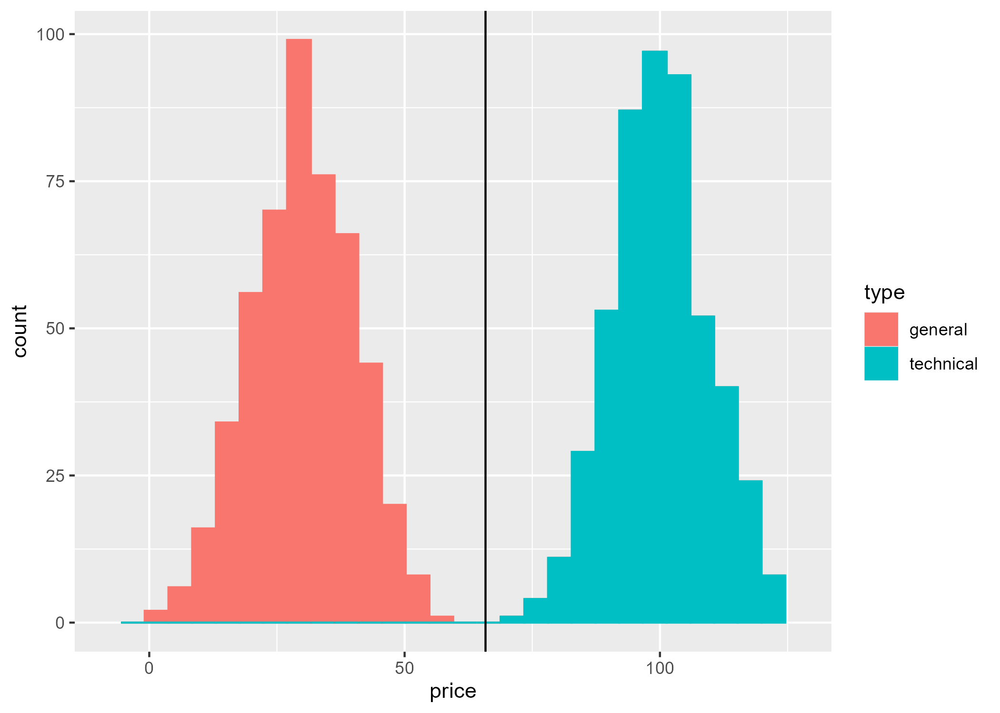
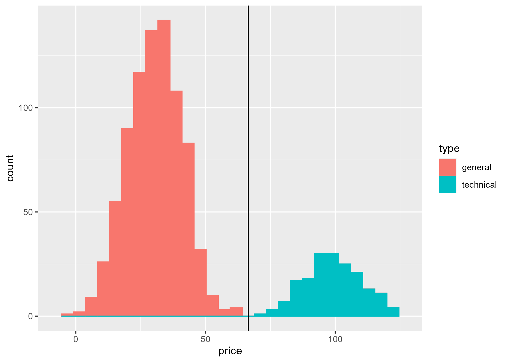
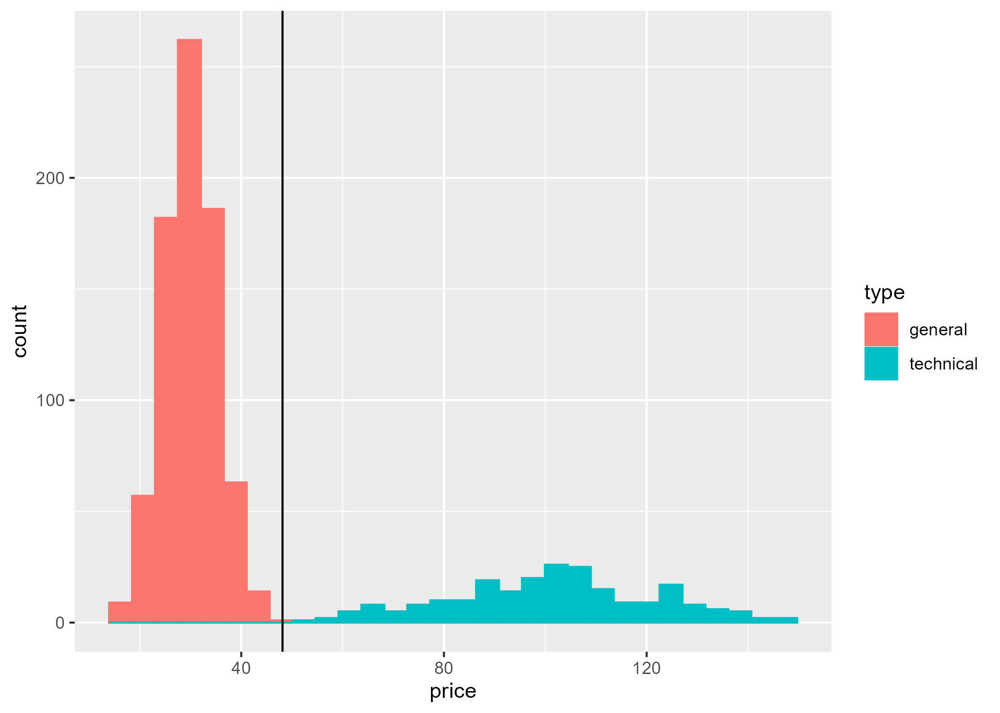

# Dimension Reduction {#sec-reduce-dim}

```{r}
#| label: setup
#| include: false

knitr::opts_chunk$set(
  echo    = FALSE, 
  error   = FALSE, 
  message = FALSE, 
  warning = FALSE
)
```

```{r}
#| label: CRAN-libraries

library(assertthat)
library(beans)
library(Cairo)
# library(cairoDevice)
library(conflicted)
library(corrplot)
library(discrim)
# library(dslabs)
library(GGally)
# library(ggimg)
library(HistData)
library(here)
library(ISLR2)
# library(LearnPCA)
# library(keras)
library(knitr)
# library(latex2exp)
library(MASS)
library(mclust)
# library(OECD)
library(patchwork)
library(plotly)
library(pracma)
library(rlang)
# library(regclass)
# library(rgl)
# library(R.utils)
# library(reticulate)
# library(scatterplot3d)
# library(tensorflow)
library(tidymodels)
library(tidyverse)
# library(tinytex)
# library(UsingR)
```

```{r}
#| label: conflicts-prefer

# resolve conflicts with plotly
conflicted::conflicts_prefer(plotly::layout)

# resolve conflicts with tidymodels packages
tidymodels_prefer()
```

```{r}
#| label: local-source

source(here("code", "d_ball.R"))
source(here("code", "galton_ht_data.R"))
source(here("code", "lda_2D.R"))
# source(here("code", "mnist_file_mgmt.R"))
# source(here("code", "NCI60_helper.R"))
# source(here("code", "oecd_bli.R"))
source(here("code", "pc_aesthetics.R"))
# source(here("code", "pgram_grid.R"))
source(here("code", "vc_per_state.R"))
source(here("code", "wine_quality_uci.R"))
# source(here("code", "z_score.R"))
```

This chapter addresses the problem of finding and visualizing structure in high-dimensional data.  We begin the discussion with example data sets.

## Data Examples {#sec-dim-r-data-examples}

### US Arrests

```{r}
#| label: stats-per-us-state-1970s

state_stats_lst <- list_state_stats()

# (x, y) = (lat, long)
st_ctr_tbl <- 
  state_stats_lst$ st_ctr_tbl

# 8 state stats: Population, ..., Area
st_77_tbl <- 
  state_stats_lst$ st_77_tbl

# UrbanPop + 3 violent crimes: Assault, Murder, Rape
arrests_wide <- 
  state_stats_lst$ arrests_wide
arrests_long <- 
  state_stats_lst$ arrests_long

# compilation of the above
st_wide <- 
  state_stats_lst$ st_wide
st_wide_dscr <- 
  state_stats_lst$ st_wide_dscr
```

Data analysis often begins with an exploration, using tables and figures to learn more about the data before formulating specific questions or hypotheses.  The exploration becomes more difficult as the dimensions of the data set increase.  Here's an example.

@McNeil_1977 reviewed the relationship among violent crime statistics per US state and the percent of the population living in urban areas, variables described in @tbl-arrests-per-us-state-1973 below.  With just four variables, we can visualize the full data structure (e.g., using a scatter plot matrix as shown in @fig-arrests-2d-scatter-matrix).  However, the initial exploratory data analysis reveals strong correlations among the three crime variables (Murder, Assault, Rape), suggesting that the data may effectively lie in fewer than four dimensions.  Dimension reduction techniques can help us identify these underlying patterns, enabling us to (1) visualize state-level crime patterns in 2D or 3D, (2) identify states having similar crime profiles, and (3) understand whether crime variation is driven by one dominant factor or multiple independent factors.

@tbl-stats-per-us-state-1970s below describes related state-level statistics from the same period (the 1970s).  The data from both tables are available from the core `R` package `datasets`.

```{r}
#| label: tbl-arrests-per-us-state-1973

st_wide_dscr |> 
  dplyr::filter(
    var %in% c("Assault", "Rape", "Murder", "UrbanPop")
  ) |> 
  dplyr::rename(variable = var, description = dscr) |> 
  knitr::kable(
    caption = "Arrests per US State (1973)")

```

```{r}
#| label: tbl-stats-per-us-state-1970s

st_wide_dscr |> 
  dplyr::filter(
    ! (var %in% c("Assault", "Rape", "Murder", "UrbanPop"))
  ) |> 
  dplyr::rename(variable = var, description = dscr) |> 
  knitr::kable(
    caption = "Statistics per US State (1970s)")
```

@fig-arrests-violin below shows the distribution across the 50 states of each type of violent crime.  Rates are calcuated as arrests per 100,000 population.  The figure shows these rates on a $\log_{10}$ scale, since assault arrests are many times more common than rape or murder arrests.

```{r}
#| label: fig-arrests-violin
#| fig-cap: "Violent Crime Rates per US State (1973)"

g_arrests_violin <- arrests_long |> 
  dplyr::filter(var != "UrbanPop") |> 
  dplyr::mutate(var = forcats::as_factor(var)) |> 
  dplyr::rename(crime = var) |> 
  ggplot2::ggplot(mapping = aes(
    x = crime, y = rate, color = crime, fill = crime
  )) + 
  geom_violin(show.legend = FALSE) + 
  scale_y_log10() + 
  labs(
    title = "Violent Crime Rates per US State (1973)", 
    subtitle = "arrests per 100K population"
  )

g_arrests_violin

```

The figure above gives a view of three data variables, that is, three columns of the data matrix.  @fig-arrests-3d-scatter below, a 3D scatterplot, gives a complementary view of each of the 50 states as a point whose coordinates are the respective arrest rates for assault, rape, and murder, with each point colored by the value of `UrbanPop` the percentage of the state's population living in an urban area.  Since individual states correspond to the rows of the data matrix, this figure is a row-based perspective on the data matrix.

```{r}
#| label: fig-arrests-3d-scatter
#| fig-cap: "Violent Crime Rates in each US State (1973)"

g_arrests_3d_scatter <- arrests_wide |> 
  plot_ly(
    x = ~Assault, 
    y = ~Rape, 
    z = ~Murder,
    type = "scatter3d",
    mode = "markers",
    text = ~arrests_wide$ st_abb,  # State abbreviation for hover
    marker = list(
      size = 5,
      color = ~UrbanPop,  # Optional: color by UrbanPop
      colorscale = "Viridis",
      showscale = TRUE,
      colorbar = list(title = "UrbanPop"))) |> 
  layout(scene = list(
    xaxis = list(title = "Assault"),
    yaxis = list(title = "Rape"),
    zaxis = list(title = "Murder")
  ),
  title = "Violent Crime Rates in each US State (1973)")

g_arrests_3d_scatter

```

@fig-arrests-2d-scatter-matrix below exemplifies a matrix of 2D scatter plots, a display method that accommodates more than 3 variables (but not many more, practically speaking). 

```{r}
#| label: fig-arrests-2d-scatter-matrix
#| fig-cap: "Arrests Variables: Relationships and Correlations"

g_arrests_2d_scatter_matrix <- arrests_wide |> 
  GGally::ggpairs(
    columns = c("Assault", "Rape", "Murder", "UrbanPop"),
    upper = list(continuous = wrap("cor", size = 3)),
    lower = list(continuous = wrap("points", alpha = 0.5, size = 0.8)),
    title = "Arrests Variables: Relationships and Correlations")

g_arrests_2d_scatter_matrix

```

This figure provides both column-based and row-based views of the data matrix, with the scatter diagrams for each pair of variables providing the row-based perspective.

### Dry Beans

@Koklu_Ozkan_2020_multiclass published a dataset of visual characteristics of dried beans "... in order to obtain uniform seed classification. For the classification model, images of 13,611 grains of 7 different registered dry beans were taken with a high-resolution camera."  The resulting dataset contains 16 morphological features extracted from each bean image, including measures of area, perimeter, compactness, length, width, and various shape factors.

The classification goal is to predict bean variety from these morphological measurements.  Successful classification could have many applications, e.g., to improve sorting systems in agricultural processing.  However, many of these 16 features are inherently redundant: for example, area and perimeter are strongly correlated, as are various length and width measurements.  Dimension reduction can reveal whether bean varieties differ primarily in size, shape, or both, and whether a smaller subset of derived features might achieve comparable classification accuracy with greater interpretability and computational efficiency.

The data are available `R` package `beans`, containing a data matrix (tibble, more precisely) of dimension $13611 \times 17$.  The last column of the data matrix is response variable `class` that assigns one of seven types of bean to each bean-image.  The remaining 16 columns of the data matrix are morphological measurements (of shape and size).

@Kuhn_Silge_tmwr develop and evaluate different classification models for these data. [^beans-ttv-split]  They begin by examining the correlation coefficients for each pair of the 16 feature vectors.  @fig-beans-corrplot follows their example.

[^beans-ttv-split]: To develop and evaluate the classification models, the authors split the observations into three non-overlapping sets: training ($n = 10206$, nearly 75%), testing $(n = 1703)$, and validation $(n = 1702)$.

```{r}
#| label: beans-tbl

beans_tbl <- beans::beans

```

```{r}
#| label: fig-beans-corrplot
#| fig-cap: "beans: correlation among features"

# from tmwr:
# tmwr_cols <- grDevices::colorRampPalette(c("#91CBD765", "#CA225E"))
# col = tmwr_cols(200)

b_corr_colors <- grDevices::colorRampPalette(c("blue", "red"))

beans_corr_lst <- beans_tbl |> 
  dplyr::select(-class) |> 
  cor() |> 
  corrplot::corrplot(
    method        = "ellipse", 
    type          = "lower", 
    diag          = FALSE, 
    # order         = "hclust", 
    # hclust.method = "complete", 
    col           = b_corr_colors(200), 
    tl.col        = "black"
  )

# from vignette("corrplot-intro"): 
# (method = 'square', order = 'FPC', type = 'lower', diag = FALSE)

```

In this figure, the absolute value of each correlation coefficient is represented by the narrowness of the drawn ellipse and the depth of its color.  The sign of the correlation coefficient is represented by both the color and direction of the ellipse.

These size and shape features measure similar concepts. Consequently, several pairs of feature vectors are highly correlated, [^beans-correlation-xmpl] which offers the possibility of transforming the 16 original features into a smaller set without sacrificing classification power.

[^beans-correlation-xmpl]: For example, the features `area` and `convex_area` can differ in principle, but for the beans data the correlation is `r beans_corr_lst$corr[["convex_area", "area"]] |> round(digits = 5)`.

### Wine Quality

```{r}
#| label: get-wine-quality

wine_quality <- get_wine_quality()

# lubridate::now()
# [1] "2025-11-04 12:46:12 GMT"

# wine_quality |> str()
# spc_tbl_ [6,497 × 13] (S3: spec_tbl_df/tbl_df/tbl/data.frame)
#  $ fixed acidity       : num [1:6497] 7.4 7.8 7.8 11.2 7.4 7.4 7.9 7.3 7.8 7.5 ...
#  $ volatile acidity    : num [1:6497] 0.7 0.88 0.76 0.28 0.7 0.66 0.6 0.65 0.58 0.5 ...
#  $ citric acid         : num [1:6497] 0 0 0.04 0.56 0 0 0.06 0 0.02 0.36 ...
#  $ residual sugar      : num [1:6497] 1.9 2.6 2.3 1.9 1.9 1.8 1.6 1.2 2 6.1 ...
#  $ chlorides           : num [1:6497] 0.076 0.098 0.092 0.075 0.076 0.075 0.069 0.065 0.073 0.071 ...
#  $ free sulfur dioxide : num [1:6497] 11 25 15 17 11 13 15 15 9 17 ...
#  $ total sulfur dioxide: num [1:6497] 34 67 54 60 34 40 59 21 18 102 ...
#  $ density             : num [1:6497] 0.998 0.997 0.997 0.998 0.998 ...
#  $ pH                  : num [1:6497] 3.51 3.2 3.26 3.16 3.51 3.51 3.3 3.39 3.36 3.35 ...
#  $ sulphates           : num [1:6497] 0.56 0.68 0.65 0.58 0.56 0.56 0.46 0.47 0.57 0.8 ...
#  $ alcohol             : num [1:6497] 9.4 9.8 9.8 9.8 9.4 9.4 9.4 10 9.5 10.5 ...
#  $ quality             : num [1:6497] 5 5 5 6 5 5 5 7 7 5 ...
#  $ color               : chr [1:6497] "red" "red" "red" "red" ...
#  - attr(*, "spec")=
#   .. cols(
#   ..   `fixed acidity` = col_double(),
#   ..   `volatile acidity` = col_double(),
#   ..   `citric acid` = col_double(),
#   ..   `residual sugar` = col_double(),
#   ..   chlorides = col_double(),
#   ..   `free sulfur dioxide` = col_double(),
#   ..   `total sulfur dioxide` = col_double(),
#   ..   density = col_double(),
#   ..   pH = col_double(),
#   ..   sulphates = col_double(),
#   ..   alcohol = col_double(),
#   ..   quality = col_double()
#   .. )
#  - attr(*, "problems")=<externalptr>
```

```{r}
#| label: wq-dimensions

# capture dimensions to embed in narrative
wq_nrow <- nrow(wine_quality)
wq_ncol <- ncol(wine_quality)
wq_n_red <- wine_quality |> 
  dplyr::filter(color == "red") |> nrow()
wq_n_white <- wine_quality |> 
  dplyr::filter(color == "white") |> nrow()
```

@Cortez_2009_wine_quality model wine preference as a function of `r wq_ncol - 1L` physicochemical properties of wine, which are listed in @tbl-wq-var-dscr. The `quality` score is the median of three expert tastings. The data consist of `r wq_nrow` wines, `r wq_n_red` red and `r wq_n_white` white. [^wq-uci-repo] [^red-v-white-wine]

[^wq-uci-repo]: The authors contributed the data (now archived) to the UC Irvine Machine Learning Repository.  See @wine_quality_data.

[^red-v-white-wine]: The wines in this study are all from the Minho (northwest) region of Portugal.  Medium in alcohol, it is appreciated for its freshness (especially in summer). At the time of writing the authors report that Minho wine accounts for 15% of total Portuguese wine production, of which some 10% is exported, mostly white wine.

The modeling goal is to understand the chemical properties influencing wine quality ratings and to predict quality from objective laboratory measurements.  Apart from wine color (red or white), the remaining `r wq_ncol - 2L` physicochemical features include related measurements, e.g., pH, fixed acidity, and citric acid are chemically interrelated, as are free and total sulfur dioxide.  Dimension reduction can help us: (1) visualize the chemical space that wines occupy in 2D or 3D, (2) identify whether wine quality varies along a small number of chemical gradients (e.g., acidity vs. alcohol content), (3) understand the chemical differences between red and white wines, and (4) determine whether a smaller set of derived features might predict quality as well as the full set of measurements.

```{r}
#| label: tbl-wq-var-dscr

wq_abbrev_tbl <- abbreviate_wq_var_names()

wq_abbrev_tbl |> 
  dplyr::select(- abbrev) |> 
  dplyr::rename(variable = var) |> 
  knitr::kable(
    caption = "Wine: physicochemical properties")
```

```{r}
#| label: wq-data-replacement

## 
#  replace wine_quality with wq_data
## 

# use abbreviated names of variables (columns)
wq_data <- wine_quality
names(wq_data) <- wq_abbrev_tbl$ abbrev

rm(wine_quality)
```

Correlations among the `r wq_ncol - 2L` numeric features are shown in @fig-rw-wq-corrplot below for red and white wines, respectively.

```{r}
#| label: fig-rw-wq-corrplot
#| fig-cap: "Wine: correlation among numeric features"
#| fig-subcap: 
#|   - "Red wines"
#|   - "White wines"
#| layout-ncol: 2

wq_corr_colors <- grDevices::colorRampPalette(c("blue", "red"))

red_wq_corr_lst <- wq_data |> 
  dplyr::filter(color == "red") |> 
  dplyr::select(-c(quality, color)) |> 
  cor() |> 
  corrplot::corrplot(
    method        = "ellipse", 
    type          = "lower", 
    diag          = FALSE, 
    col           = wq_corr_colors(200), 
    tl.col        = "black"
  )

white_wq_corr_lst <- wq_data |> 
  dplyr::filter(color == "white") |> 
  dplyr::select(-c(quality, color)) |> 
  cor() |> 
  corrplot::corrplot(
    method        = "ellipse", 
    type          = "lower", 
    diag          = FALSE, 
    col           = wq_corr_colors(200), 
    tl.col        = "black"
  )

```

These figures reveal some substantial correlations, with distinct patterns per wine color.

@tbl-rw-quality-corr below shows feature-quality correlations for red and white wines, respectively.

```{r}
#| label: rw-quality-corr-tbl

rw_quality_corr_tbl <- wq_data |> 
  get_rw_quality_corr_tbl()

```

```{r}
#| label: tbl-rw-quality-corr
#| tbl-cap: "Feature-quality correleations among (red, white) wines"

rw_quality_corr_tbl |> 
  knitr::kable(
    caption = "Feature-quality correleations", 
    digits = 2
  )

```

We see that alcohol volume is a prominent indicator of quality for both red and white wines.  On the other hand, citric acid and sulphates are strongly correlated with the quality of red wine, but not white.

As demonstrated by @Cortez_2009_wine_quality, these data patterns offer the possibility of developing a smaller set of features as predictors of wine quality.

### Cancer Genomics (NCI60)

```{r}
#| label: NCI60-structure

# data dimensions
nrow_NCI60       <- ISLR2::NCI60$ data |> nrow()
ncol_NCI60       <- ISLR2::NCI60$ data |> ncol()

# row labels
lbl_NCI60        <- ISLR2::NCI60$ labs
lbl_unique_NCI60 <- lbl_NCI60 |> 
  unique() |> sort()
n_u_labels_NCI60 <- length(lbl_unique_NCI60)
lbl_ct_NCI610    <- lbl_NCI60 |> 
  tibble::as_tibble_col(column_name = "label") |> 
  dplyr::summarise(.by = "label", ct = n()) |> 
  dplyr::arrange(label)
lbl_ct_vec_NCI610 <- lbl_ct_NCI610 |> 
  dplyr::pull(name = label)
```

The NCI60 data [^ISLR2-NCI60] [^Ross-2000-citation] consists of gene expression measurements from `r nrow_NCI60` cancer cell lines. For each cell line, expression levels were measured for `r ncol_NCI60` genes using microarray technology. The cell lines represent `r n_u_labels_NCI60` different cancer types, including leukemia, melanoma, and cancers of the colon, breast, ovary, lung, and central nervous system. This data set is a canonical example of a high-dimensional data matrix where the number of features $(d)$ greatly exceeds the number $n$ of data cases: $d \gg n$.

[^ISLR2-NCI60]: The data are available from `R` package `ISLR2`.  The vector of labels (cancer type per observation) can be accessed as `ISLR2::NCI60$labs`.  The data can be accessed as `ISLR2::NCI60$data` in the form of a $64 \times 6830$ matrix with column names "1", "2", ..., "6830" rather than gene identifiers.  While this simplification is adequate for illustrating dimension reduction methods, readers requiring gene-level biological interpretation should consult the `rcellminer` and `rcellminerData` Bioconductor packages (Luna et al., 2016; Reinhold et al., 2019), which provide the same data with complete gene annotations and represent the current standard for programmatic access to NCI-60 molecular profiling data.

[^Ross-2000-citation]: The `ISLR2` package cites @Ross_2000_Systematic as the source of `ISLR2::NCI60`.

The data set is part of the NCI-60 panel and associated datasets, which are maintained by the Frederick National Laboratory for Cancer Research (FNLCR) and the National Cancer Institute's (NCI) Developmental Therapeutics Program (DTP).  The data serve as a publicly available platform for the global cancer research community to study tumor biology, evaluate new bioinformatics approaches, and select appropriate cell models for specific research questions.

These data present challenges that require dimension reduction, that is, the transformation of the set of `r ncol_NCI60` genomic features into a smaller set that capture the dominant patterns of variation.  We proceed to describe such challenges.

## Dimensionality: Curse and Blessing {#sec-dim-r-curse}

As just noted, the NCI60 data set, with $d =$ `r ncol_NCI60` and $n =$ `r nrow_NCI60`, presents challenges that make dimension reduction essential. Several issues arise with any "wide" data set in which $d \gg n$, and include the following.

  - _Visualization_: We cannot plot points in  $d$ dimensions to explore patterns or detect outliers.
  
  - _Over-fitting_: With $d \gg n$, infinitely many coefficient vectors $\beta_\bullet$ produce identical predictions that replicate the response variable within the training data.  This makes model selection impossible without regularization.
  
  - _Computation_: Storing and manipulating a $d \times d$ covariance matrix becomes prohibitively expensive.

In 1957 Richard Bellman characterized such challenges as "the curse of dimensionality". [^dim-curse]

[^dim-curse]: See @Bellman_1957_dynamic, @Donoho_2000_High_Dimensional_Data_Analysis, and @wiki_curse_dimensionality.

@Donoho_2000_High_Dimensional_Data_Analysis points out that: (1) many established statistical methods assume $d < n$; and (2) we can expect $d \gg n$ to occur more and more often as data-collection is increasingly automated to retrieve all potentially useful details for subsequent screening.

In addition, @wiki_curse_dimensionality notes that our geometric intuition is grounded in $d \le 3$ and is overturned as $d$ increases.  To illustrate, consider a unit hypercube $[0,1]^d$ containing the largest possible inscribed ball. The ratio $r(d)$ of their volumes shrinks dramatically: $r(3) \approx 0.52$, $r(10) \approx 0.0025$, and $r(100) \approx 2 \times 10^{-70}$. In high dimensions, the preponderance of randomly generated points within the cube land far from the center!

Yet @Donoho_2000_High_Dimensional_Data_Analysis also sees opportunities.   While randomly generated data in high dimensions behaves pathologically (at least from a 3D perspective), actual data tend to be more coherent.  Consider the example data sets:

- _US Arrests_: The three crime variables (assault, rape, murder) are 
  highly correlated; they don't independently span 3D space (@fig-arrests-3d-scatter).
- _Dry_Beans_: The 16 shape measurements aren't independent; they reflect underlying bean geometry.  
- _Wine quality_: The 11 chemical properties are constrained by 
  fermentation chemistry.
- _NCI60_: The 6,830 genes participate in shared biological pathways.

In each case, the data likely occupies a much lower-dimensional structure within the high-dimensional feature space. If we can identify this structure, we are likely to _improve_ any subsequent statistical modeling.

The remainder of this chapter develops methods that exploit such opportunities. We begin with Principal Component Analysis (PCA, @sec-dim-r-pca), which finds low-dimensional approximations to high-dimensional data through eigen-decomposition.  Then @sec-dim-r-lda presents Linear Discriminant Analysis (LDA) as an example of dimension reduction designed to identify the category (of two or more possible categories) of a new observation. The chapter concludes with a brief overview of other methods of dimension reduction.

## PCA: Principal Component Analysis {#sec-dim-r-pca}

Principal Component Analysis (PCA) is one of the most widely used methods to approximate a feature matrix of $d$ features with substantially fewer linear combinations of those features.  The goal is to reveal the primary structure of the data and facilitate subsequent analyses (regression or classification, for example).

We introduce the concept of a principal component using a 2D example (Galton height data), present a 3D example (US Arrest data) of constructing a single index of violent crime arrests from the three types of crimes in the feature matrix, and then move on to higher dimensional examples.  See @r_doc_LearnPCA for an in-depth introduction to PCA.

### 2D Example: Galton heights

To develop some geometric intuition we begin with a 2D example.  @fig-fs-pca below illustrates PCA for (father, son) centered heights from the Galton data presented in @sec-la-intro.

```{r}
#| label: fms-galton

galton_3d_lst <- get_galton_3d()

# tibble(father, mother, child, gender)
# (child, gender) refers to oldest child
galton_3d <- galton_3d_lst$ galton_3d

fms_tbl <- galton_3d |> 
  dplyr::filter(gender == "male") |> 
  dplyr::select(- gender) |> 
  dplyr::rename(son = child)

# center data variables using base::scale()
fms_ctr <- fms_tbl |> 
  dplyr::mutate(dplyr::across(
    .cols = c(mother, father, son), 
    .fns  = scale, scale = FALSE
  )) |> 
  # change scale() output from matrix to vector
  dplyr::mutate(dplyr::across(
    .cols = c(mother, father, son), 
    .fns  = as.vector
  ))

```

```{r}
#| label: fs-pca

# PCA(father, son)
fs_pca_lst <- fms_ctr |> 
  dplyr::select(father, son) |> 
  stats::prcomp(center = FALSE) |> 
  # coerce rotation matrix to have mostly positive diagonal
  pc_rot_diag()

# rotation matrix
fs_rot_mat <- fs_pca_lst$ rotation
# fs_rot_mat
#              PC1        PC2
# father 0.7041940 -0.7100076
# son    0.7100076  0.7041940

# slope coefficients for geom_abline()
fs_slope_1 <- 
  fs_rot_mat [["son",    "PC1"]] / 
  fs_rot_mat [["father", "PC1"]]
fs_slope_2 <- 
  fs_rot_mat [["son",    "PC2"]] / 
  fs_rot_mat [["father", "PC2"]]

# TODO: change fs_slope_i to fs_slope [[i]]

```

```{r}
#| label: pca-colors

# color per component: actual and cited color names
pc_colors_tbl <- get_pc_colors()

pc_clr <- pc_colors_tbl$ color
pc_ref <- pc_colors_tbl$ ref

```

```{r}
#| label: fs-pca-end-pts

# represent each component as a directed 
# line segment anchored at the origin
fs_pca_end_pt_mat <- fs_pca_lst |> 
  get_pc_segs()

f_end_pc_1 <- fs_pca_end_pt_mat [["father", "PC1"]]
f_end_pc_2 <- fs_pca_end_pt_mat [["father", "PC2"]]

s_end_pc_1 <- fs_pca_end_pt_mat [["son",    "PC1"]]
s_end_pc_2 <- fs_pca_end_pt_mat [["son",    "PC2"]]

# TODO: use fs_pca_end_pt_mat directly

```

```{r}
#| label: fig-fs-pca
#| fig-cap: "Principal Components: (father, son) centered heights"

g_fs_pcs <- fms_ctr |> 
  dplyr::select(father, son) |> 
  ggplot2::ggplot(mapping = aes(
    x = father, y = son
  )) + 
  ggplot2::geom_point() + 
  ggplot2::coord_fixed(ratio = 1) + 
  
  # 1st pc
  ggplot2::geom_abline(
    intercept = 0, 
    slope = fs_slope_1, 
    color = pc_clr [[1]]) + 
  ggplot2::geom_segment(
    mapping = aes(
      x = 0, xend = f_end_pc_1,
      y = 0, yend = s_end_pc_1
    ),
    arrow = arrow(
      length = unit(0.3, "cm"), 
      ends = "last", type = "closed"
    ),
    linetype = 3, linewidth = 0.8, color = pc_clr [[1]]
  ) + 
  
  # 2nd pc
  ggplot2::geom_abline(
    intercept = 0, 
    slope = fs_slope_2, 
    color = pc_clr [[2]]) + 
  ggplot2::geom_segment(
    mapping = aes(
      x = 0, xend = f_end_pc_2,
      y = 0, yend = s_end_pc_2
    ),
    arrow = arrow(
      length = unit(0.3, "cm"), 
      ends = "last", type = "closed"
    ),
    linetype = 3, linewidth = 0.8, color = pc_clr [[2]]
  ) + 
  
  ggplot2::labs(
    title = "PCA: (father, son) centered heights") + 
  ggplot2::labs(
    subtitle = bquote(
      c[1] * ": " * ~ .(pc_ref [[1]]) * ", " * 
      c[2] * ": " * ~ .(pc_ref [[2]])
    )
  )

g_fs_pcs

```

The figure represents two principal components, $(c_1, c_2)$, as respective `r pc_ref [[1]]` and `r pc_ref [[2]]` lines, which are perpendicular to one another.

The `r pc_ref [[1]]` line $(c_1)$ points in the direction where the data varies most. Projecting points onto this line captures the maximum possible variance in a single dimension. The `r pc_ref [[2]]` line $(c_2)$ is perpendicular to $c_1$ and captures the maximum remaining variance. Together, they form a rotated coordinate system that aligns with the data's natural variation.

### 3D Example: US Arrests

We now revisit `datasets::USArrests`, which gives the number of arrests per 100,000 population for violent crimes in each of the 50 US states in 1973.  A possible use of PCA is to define a linear combination of the three types of arrests that would serve as a one-dimensional index of violent crime.

Recall that the respective arrest rates for assault, rape, and murder (listed from highest to lowest rate) are on quite different scales.  Without some adjustment, assault rates would dominate the total variance of the data and consequently the determination of principal components.  Yet the severity of the societal problem is a function of both the rate of a crime and the nature of the crime.  As an initial (if not definitive) adjustment, we have transformed each rate into a z-score by subtracting the mean and dividing by the standard deviation (each calculated across the 50 US states).  We've labeled the respective z-scores: `z_Assault`, `z_Rape`, and `z_Murder`.

@fig-arm-pca is a 3D scatterplot of these z-scores, and also shows their three principal components $(c_1, c_2, c_3)$ in respective colors: `r pc_ref[[1]]`, `r pc_ref[[2]]`, and `r pc_ref[[3]]`.

```{r}
#| label: arrest-rate-z-scores

# center and scale the 3 arrest rates from the USArrests data
z_arrests_mat <- arrests_wide |> 
  dplyr::select(Assault, Rape, Murder) |> 
  scale()

z_arrests_tbl <- arrests_wide |> 
  dplyr::select(st_abb, st_nm, UrbanPop) |> 
  dplyr::mutate(
    z_assault = z_arrests_mat [, "Assault"], 
    z_rape    = z_arrests_mat [, "Rape"], 
    z_murder  = z_arrests_mat [, "Murder"]
  )

```

```{r}
#| label: z-arrests-pca-lst

# z_arrests |> PCA
  z_arrests_pca_lst <- z_arrests_tbl |> 
  dplyr::select(z_assault, z_rape, z_murder) |> 
  stats::prcomp(center = FALSE) |> 
  # coerce rotation matrix to have mostly positive diagonal
  pc_rot_diag()

# record dimensions of rotation matrix
n_arrests_rot_rows <- z_arrests_pca_lst$ rotation |> nrow()
n_arrests_rot_cols <- z_arrests_pca_lst$ rotation |> ncol()

# z_arrests_pca_lst$ rotation
#                 PC1        PC2        PC3
# z_assault 0.6079818 -0.2140236  0.7645600
# z_rape    0.5393836  0.8179779 -0.1999436
# z_murder  0.5826006 -0.5339532 -0.6127565

```

```{r}
#| label: z-arrest-pca-end-pts

# represent each component as a directed 
# line segment anchored at the origin
arm_pca_end_pt_mat <- z_arrests_pca_lst |> 
  get_pc_segs()

# arm_pca_end_pt_mat |> print(digits = 2)
#           PC1   PC2   PC3
# z_assault 1.5 -0.29  0.69
# z_rape    1.4  1.12 -0.18
# z_murder  1.5 -0.73 -0.55

```

```{r}
#| label: fig-arm-pca
#| fig-cap: "US Arrest Z-scores: Principal Components"

# Create 3D scatterplot with principal component directions
g_arm_pca <- plot_ly(
  x = z_arrests_tbl$z_assault, 
  y = z_arrests_tbl$z_rape, 
  z = z_arrests_tbl$z_murder, 
  type = "scatter3d",
  mode = "markers",
  # mode = "markers+text", 
  text = z_arrests_tbl$st_abb, 
  # textposition = "top center", 
  # textfont = list(size = 8), 
  marker = list(
    size = 4,
    color = "steelblue",
    opacity = 0.7
  ),
  name = "State"
)

# PC axes: add directed line segments from origin
for (i in 1:3) {
  g_arm_pca <- g_arm_pca |> 
    add_trace(
      x = c(0, arm_pca_end_pt_mat["z_assault", i]), 
      y = c(0, arm_pca_end_pt_mat["z_rape", i]), 
      z = c(0, arm_pca_end_pt_mat["z_murder", i]), 
      type = "scatter3d",
      mode = "lines",
      line = list(width = 6, color = pc_clr[i]),
      name = paste0("PC", i),
      showlegend = FALSE,
      inherit = FALSE  # Added: prevents inheriting marker properties
    )
}

g_arm_pca <- g_arm_pca |> layout(
  scene = list(
    xaxis = list(title = "z_Assault"),
    yaxis = list(title = "z_Rape"),
    zaxis = list(title = "z_Murder"),
    aspectmode = "cube"
  ),
  title = "US Arrest Z-scores: Principal Components"
)

g_arm_pca

```

The first principal component $(c_1)$ is a promising representative of the overall level of violent crime per state.  As @fig-arm-loadings shows, the coefficient (also called "loading") of each z-score variable is positive.  Consequently a violent crime index aligned with $c_1$ would respond to an increase in any one of the three types of crime. [^crime-index]

[^crime-index]: Of course the construction of a violent crime index might begin with a principal component analysis (PCA), but would require more work.  To render the index as a rate per 100,000 population, we might consider taking a weighted geometric mean of the three underlying rates, with the weights derived in part from PCA.

```{r}
#| label: z-arrests-rot

# prepare to plot component loadings (coefficients)
z_arrests_rot_lst <- 
  z_arrests_pca_lst |> 
  get_rot_tbl_lst()

z_arrests_rot_wide <- z_arrests_rot_lst$ rot_wide
z_arrests_rot_long <- z_arrests_rot_lst$ rot_long

```

```{r}
#| label: fig-arm-loadings
#| fig-cap: "US Arrests: coefficients of each principal component"

g_arm_loadings <- z_arrests_rot_long |> 
  dplyr::mutate(crime = forcats::as_factor(var)) |> 
  ggplot2::ggplot(mapping = aes(
    x = crime, y = coeff, color = pc, fill = pc
  )) + 
  ggplot2::geom_col(
    color = rep(pc_clr, each = n_arrests_rot_cols), 
    fill  = rep(pc_clr, each = n_arrests_rot_cols), 
    show.legend = FALSE
  ) + 
  ggplot2::facet_grid(rows = vars(pc)) + 
  ggplot2::geom_hline(
    yintercept = 0, color = "red", 
    linetype = 2, linewidth = 1
  ) + 
  ggplot2::labs(
    title = "US Arrests: coefficients of each principal component"
  )
g_arm_loadings
```

We would want any such index to account for a preponderance of the total variation (which is the sum of the variances of each type of arrest rate).  Note that the z-scores are constrained to have unit variance, so the total variation among the three z-scores is 3.  Here are the amounts of that total variation accounted for by the 3 principal components.

```{r}
#| label: z-arm-pc-stats

z_arm_pc_stats <- z_arrests_pca_lst |> 
  get_pc_stats()
```

```{r}
#| label: tbl-z-arm-pc-stats
#| tbl-cap: "Arrest z-scores: variance of principal components"

z_arm_pc_stats |> 
  dplyr::mutate(across(
    .cols = sd:var_pct, 
    .fns = ~ signif(.x, digits = 2)
  )) |> 
  dplyr::select(- idx) |> 
  dplyr::rename(variance = var) |> 
  knitr::kable(
    caption = "Arrest z-scores: variance of principal components"
  )

```

We see that the first principal component "PC1" $(c_1)$ accounts for `r round(z_arm_pc_stats [[1, "var_pct"]])` percent of the total variation, making it a good candidate indeed for a violent crime index (or at least a reference for such an index).

### Terminology

@sec-dim-r-mat-decomp gives mathematical definitions of principal components and related terms in some detail.  In this section we present the main ideas.

#### First principal component 

The first principal component, [^pc-row-v-column-interpretation] $c_{\bullet, 1}$, of the centered, $n \times d$ feature matrix $X_{\bullet, \bullet}$ is a particular linear combination of the columns of $X_{\bullet, \bullet}$, that is, a particular linear combination of the centered, $n-$dimensional feature vectors $(x_{\bullet, 1}, \ldots, x_{\bullet, d})$.  The $d$ coefficients of this linear combination are the elements of the $d-$dimensional vector $v_{\bullet, 1}$, a "unit vector", meaning a vector of norm 1.

[^pc-row-v-column-interpretation]: The term "principal component" may refer either to the $n-$dimensional vector $c_{\bullet, 1}$ or to the $d-$dimensional vector of its coefficients $v_{\bullet, 1}$.  The identity $c_{\bullet, 1} = X_{\bullet, \bullet} \; v_{\bullet, 1}$ is a mapping, $v_{\bullet, 1} \mapsto c_{\bullet, 1}$.  Scatterplots and other visualizations of individual cases of data represent _rows_ of the feature matrix $X_{\bullet, \bullet}$.  This is the perspective of $d-$space, to which $v_{\bullet, 1}$ belongs.  Model formulations, such as $y = X \beta + \epsilon$ represent _columns_ of the feature matrix, which is the perspective of $n-$space, to which $c_{\bullet, 1}$ belongs.

$$
\begin{align}
  c_{\bullet, 1} 
  &= 
   v_{1, 1} x_{\bullet, 1} \; + \; 
   \cdots \; + \; 
   v_{d, 1} x_{\bullet, d} \\ 
   &= 
   X_{\bullet, \bullet} \; v_{\bullet, 1}
   & \text{ with } \lVert v_{\bullet, 1} \rVert = 1
\end{align}
$$ {#eq-define-c-1-a}

Each respective coefficient $v_{k, 1}$ is also called the _loading_ of the $k^{th}$ feature vector $x_{\bullet, k}$ onto the first principal component.

Of all $d-$dimensional unit vectors $v_\bullet$, each generating a linear combination $X_{\bullet, \bullet} \; v_\bullet$ of feature vectors, $v_{\bullet, 1}$ has the distinction of maximizing the norm of $X_{\bullet, \bullet} \; v_\bullet$. 

$$
\begin{align}
  \lVert c_{\bullet, 1} \rVert 
  &= 
    \lVert 
      X_{\bullet, \bullet} \; v_{\bullet, 1} 
    \rVert \\ 
  &= 
    \max \left \{ 
      \lVert 
        X_{\bullet, \bullet} \; v_\bullet 
      \rVert 
      : \; 
        \lVert v_\bullet \rVert = 1
    \right \}
\end{align}
$$ {#eq-max-norm-c-1}

Since each feature vector $x_{\bullet, k}$ is centered, its squared norm, $\lVert x_{\bullet, k} \rVert^2$, is an $(n - 1)$ multiple of its sample variance $var(x_{\bullet, k})$.  Consequently, $c_{\bullet, 1}$ also maximizes sample variance.

$$
\begin{align}
  & 
    var (c_{\bullet, 1})  \\
  &= 
    \frac{1}{n - 1} \; 
    \lVert c_{\bullet, 1} \rVert^2 \\
  &= 
    \frac{1}{n - 1} \; 
    \lVert 
      X_{\bullet, \bullet} \; v_{\bullet, 1} 
    \rVert^2 \\ 
  &= 
    \max \left \{ 
      \frac{1}{n - 1} \; 
      \lVert 
        X_{\bullet, \bullet} \; v_\bullet 
      \rVert^2 
      : \; 
        \lVert v_\bullet \rVert = 1
    \right \} \\
  &= 
    \max \left \{ 
      var 
      \left ( 
        X_{\bullet, \bullet} \; v_\bullet 
      \right ) 
      : \; 
        \lVert v_\bullet \rVert = 1
    \right \}
\end{align}
$$ {#eq-max-variance-c-1}

Now the coefficient vector $v_{\bullet, 1}$ is an eigenvector of matrix  $X_{\bullet, \bullet}^\top \; X_{\bullet, \bullet}$ whose eigenvalue is denoted $\sigma_1^2$. [^cov-matrix-polar-decomposition]

[^cov-matrix-polar-decomposition]: $X_{\bullet, \bullet}^\top \; X_{\bullet, \bullet}$ is a $d \times d$ symmetric, non-negative definite matrix.  Any such matrix admits an eigen-decomposition (or polar decomposition) into a complete set of eigenvectors $(v_{\bullet, 1}, \ldots, v_{\bullet, d})$ and corresponding eigenvalues $\sigma_1^2 \ge \sigma_2^2 \; \cdots \; \ge \sigma_d^2 \ge 0$.  The set of eigenvectors is an orthonormal basis for $\mathbb{R}^d$.  From these facts one can show that $\lVert X_{\bullet, \bullet} \; v_\bullet \rVert^2 = v_\bullet^\top \; X_{\bullet, \bullet}^\top \; X_{\bullet, \bullet} \; v_\bullet$, with $\Vert v_\bullet \rVert = 1$, is maximized by $v_{\bullet, 1}$.

$$
\begin{align} 
  \left ( 
    X_{\bullet, \bullet}^\top \; X_{\bullet, \bullet} 
  \right ) \; 
  v_{\bullet, 1} 
&= 
  \sigma_1^2 \; v_{\bullet, 1} 
\end{align} 
$$ {#eq-Xt-X-eigen-1-a}

Eigenvalue $\sigma_1^2$ is the largest eigenvalue of matrix  $X_{\bullet, \bullet}^\top \; X_{\bullet, \bullet}$, and is also the squared norm of principal component $c_{\bullet, 1}$.

$$
\begin{align}
& 
  \lVert 
    c_{\bullet, 1} 
  \rVert^2  \\ 
&= 
  \left < 
    c_{\bullet, 1}, \; 
    c_{\bullet, 1}
  \right >  \\ 
&= 
  \left < 
    X_{\bullet, \bullet} \; v_{\bullet, 1}, \; 
    X_{\bullet, \bullet} \; v_{\bullet, 1}
  \right >  \\ 
&= 
  \left < 
    v_{\bullet, 1}, \; 
    X_{\bullet, \bullet}^\top \; X_{\bullet, \bullet} \; v_{\bullet, 1}
  \right >  \\ 
&= 
  \left < 
    v_{\bullet, 1}, \; 
    \sigma_1^2 \; v_{\bullet, 1}
  \right >  \\ 
&= 
  \sigma_1^2 \; 
  \left < 
    v_{\bullet, 1}, \; 
    v_{\bullet, 1}
  \right >  \\ 
&= 
  \sigma_1^2 \; 
  \lVert 
    v_{\bullet, 1} 
  \rVert^2  \\ 
&= 
  \sigma_1^2 
\end{align}
$$ {#eq-norm-sq-pc-1-a}

The normalized first principal component 

$$
\begin{align}
  u_{\bullet, 1} 
  &= 
    \frac 
      { c_{\bullet, 1} }
      { \lVert  c_{\bullet, 1} \rVert } \\ 
  &= 
    \frac 
      { 1 }
      { \sigma_1 } \; 
    c_{\bullet, 1}
\end{align}
$$ {#eq-pc-unit-1-a}

is a unit vector called the first _left singular vector_ of the feature matrix $X_{\bullet, \bullet}$ due to the following property: 

$$
\begin{align}
  & 
    u_{\bullet, 1}^\top \; X_{\bullet, \bullet} \\ 
  &= 
    \frac 
      { 1 }
      { \sigma_1 } \; 
    c_{\bullet, 1}^\top \; X_{\bullet, \bullet} \\ 
  &= 
    \frac 
      { 1 }
      { \sigma_1 } \; 
    \left ( 
      X_{\bullet, \bullet}^\top \; c_{\bullet, 1} 
    \right )^\top \\ 
  &= 
    \frac 
      { 1 }
      { \sigma_1 } \; 
    \left ( 
      X_{\bullet, \bullet}^\top \; 
      X_{\bullet, \bullet} \; 
      v_{\bullet, 1} 
    \right )^\top \\ 
  &= 
    \frac 
      { 1 }
      { \sigma_1 } \; 
    \left ( 
      \sigma_1^2 \; 
      v_{\bullet, 1} 
    \right )^\top \\ 
  &= 
    \sigma_1 \; 
    v_{\bullet, 1}^\top  
\end{align}
$$ {#eq-map-left-to-right-unit-1-a}

so that 

$$
\begin{align}
    X_{\bullet, \bullet}^\top \; 
    u_{\bullet, 1} 
  &= 
    \sigma_1 \; 
    v_{\bullet, 1} 
\end{align}
$$ {#eq-map-left-to-right-unit-1-b}

This last equality gives a mapping $u_{\bullet, 1} \mapsto \sigma_1 \;  v_{\bullet, 1}$ from left to right singular vectors of the feature matrix.  These terms align with the _singular value decomposition_ (SVD) of the feature matrix, which is described in @sec-dim-r-mat-decomp.

#### Scores of the first principal component

The $n$ elements of vector $c_{\bullet, 1}$, namely $(c_{1, 1}, \ldots, c_{n, 1})$, are called the _scores_ of the first principal component.

$$
\begin{align}
  score_{i, 1} 
  &= 
    c_{i, 1} \\ 
  &= 
    \left < 
      x_{i, \bullet}, \; 
      v_{\bullet, 1}
    \right > 
\end{align}
$$ {#eq-score-i-1}

In other words, the $i^{th}$ score is the inner product of the $i^{th}$ row of the feature matrix with the coefficient vector $v_{\bullet, 1}$.

Here's a geometric representation of this score within the context of $d-$dimensional vectors.  The coefficient vector $v_{\bullet, 1}$ defines a line, say $\mathcal{l}_d (v_{\bullet, 1})$, which is a one-dimensional subspace of $\mathbb{R}^d$ consisting of all scalar multiples of $v_{\bullet, 1}$.

$$
\begin{align}
  \mathcal{l}_d (v_{\bullet, 1}) 
  &= 
    \left \{ 
      s \; 
      v_{\bullet, 1}
      : \; 
      s \in \mathbb{R}
    \right \} 
\end{align}
$$ {#eq-dim-1-subspace-of-d-space}

The $d \times d$ matrix $v_{\bullet, 1} \; v_{\bullet, 1}^\top$ represents an orthogonal projection of $\mathbb{R}^d$ onto $\mathcal{l}_d (v_{\bullet, 1})$.  In particular, this projection sends the $i^{th}$ row of the feature matrix, $x_{i, \bullet}$ to $score_{i, 1} \times v_{\bullet, 1}$.

$$
\begin{align}
  & 
    \left ( 
      v_{\bullet, 1} \; v_{\bullet, 1}^\top
    \right ) \; 
    x_{i, \bullet} \\ 
  &= 
    v_{\bullet, 1} \; 
    \left ( 
      v_{\bullet, 1}^\top \; 
      x_{i, \bullet}
    \right ) \\ 
  &= 
    \left ( 
      v_{\bullet, 1}^\top \; x_{i, \bullet}
    \right ) \; 
    v_{\bullet, 1} \\ 
  &= 
    \left < 
      x_{i, \bullet}, \; 
      v_{\bullet, 1}
    \right > \; 
    v_{\bullet, 1} \\ 
  &= 
    score_{i, 1} \;  
    v_{\bullet, 1} \\ 
  & \in 
    \mathcal{l}_d (v_{\bullet, 1})
\end{align}
$$ {#eq-project-row-i-onto-dim-1-d-subspace}

#### Remaining principal components

The remaining coefficient vectors are members of the sequence $(v_{\bullet, 1}, \ldots, v_{\bullet, d})$ of eigenvectors and corresponding eigenvalues $\sigma_1^2 \ge \cdots \ge \sigma_d^2 \ge 0$ of matrix $X_{\bullet, \bullet}^\top X_{\bullet, \bullet}$.  The first $r$ of these eigenvalues are all positive, with any remaining eigenvalues all equal to zero.  Here $r = rank(X_{\bullet, \bullet})$.  These first $r$ eigenvectors define the entire set of $r$ principal components:

$$
\begin{align}
  c_{\bullet, \eta} &= 
    X_{\bullet, \bullet} \; v_{\bullet, \eta} 
    & \text{ for } 1 \le \eta \le r
\end{align}
$$ {#eq-r-PCs}


### Computation

There are two distinct approaches to calculating principal components: 

  1. _EVD_ (eigenvalue decomposition): Calculate $X_{\bullet, \bullet}^\top \; X_{\bullet, \bullet}$ and then calculate the eigenvalues and eigenvectors of this $d \times d$ matrix.
  
  1. _SVD_ (singular value decomposition): Use the matrix factorization $X_{\bullet, \bullet} = U_{\bullet, \bullet} \; \Sigma_{\bullet, \bullet} \; V_{\bullet, \bullet}^\top$.  

If $r = rank(X_{\bullet, \bullet})$, then the SVD factorization can be expressed as the sum of $r$ terms, each term being an $n \times d$ matrix of rank 1:

$$
\begin{align}
  X_{\bullet, \bullet} 
  &= 
    \sum_{\eta = 1}^r 
      \sigma_\eta \; u_{\bullet, \eta} \; v_{\bullet, \eta}^\top
\end{align}
$$ {#eq-svd-as-sum-rank-r}

If the number of features $d$ is large, then the calculation of the $d \times d$ matrix $X_{\bullet, \bullet}^\top \; X_{\bullet, \bullet}$, required by EVD, may be cumbersome or impractical.

Either approach requires careful planning for a large feature matrix, but the SVD approach is typically used.  For example, SVD is the approach used by `R` function `stats::prcomp()`.

In some situations it is practical to reduce the number of terms appearing in @eq-svd-as-sum-rank-r.  The truncated sum merely approximates the feature matrix, but that approximation may be adequate.  See @Martin_2012_SVD for an overview of applications and extensions of SVD algorithms.

### Detailed Example: Wine Quality

```{r}
#| label: wq-all-numeric

# 6497-by-13 data tibble with color re-coded as "is_red"
wq_all_numeric <- wq_data |> 
  dplyr::mutate(is_red = (color == "red")) |> 
  dplyr::select(- color)

# wq_all_numeric |> str()
# tibble [6,497 × 13] (S3: tbl_df/tbl/data.frame)
#  $ fixed acidity       : num [1:6497] 7.4 7.8 7.8 11.2 7.4 7.4 7.9 7.3 7.8 7.5 ...
#  $ volatile acidity    : num [1:6497] 0.7 0.88 0.76 0.28 0.7 0.66 0.6 0.65 0.58 0.5 ...
#  $ citric acid         : num [1:6497] 0 0 0.04 0.56 0 0 0.06 0 0.02 0.36 ...
#  $ residual sugar      : num [1:6497] 1.9 2.6 2.3 1.9 1.9 1.8 1.6 1.2 2 6.1 ...
#  $ chlorides           : num [1:6497] 0.076 0.098 0.092 0.075 0.076 0.075 0.069 0.065 0.073 0.071 ...
#  $ free sulfur dioxide : num [1:6497] 11 25 15 17 11 13 15 15 9 17 ...
#  $ total sulfur dioxide: num [1:6497] 34 67 54 60 34 40 59 21 18 102 ...
#  $ density             : num [1:6497] 0.998 0.997 0.997 0.998 0.998 ...
#  $ pH                  : num [1:6497] 3.51 3.2 3.26 3.16 3.51 3.51 3.3 3.39 3.36 3.35 ...
#  $ sulphates           : num [1:6497] 0.56 0.68 0.65 0.58 0.56 0.56 0.46 0.47 0.57 0.8 ...
#  $ alcohol             : num [1:6497] 9.4 9.8 9.8 9.8 9.4 9.4 9.4 10 9.5 10.5 ...
#  $ quality             : num [1:6497] 5 5 5 6 5 5 5 7 7 5 ...
#  $ is_red              : logi [1:6497] TRUE TRUE TRUE TRUE TRUE TRUE ...

```

```{r}
#| label: wq-smy

# mean and sd of each wine variable
wq_smy <- wq_all_numeric |> 
  tidyr::pivot_longer(
    cols = tidyr::everything(), 
    names_to = "variable", 
    values_to = "value") |> 
  dplyr::summarise(
    .by = variable, 
    mean  = mean(value), 
    sd    = sd(value)
  ) |> 
  dplyr::mutate(i_var = 1:ncol(wq_all_numeric)) |> 
  dplyr::select(i_var, tidyr::everything())
```

We now apply PCA to the wine quality data introduced earlier.  We prepare the data by (1) re-coding the character variable `color` to the logical (binary) variable `is_red`; and (2) centering each variable.  We should also decide whether to scale the centered variables, based on the following summary.

```{r}
#| label: tbl-wq-smy
#| tbl-cap: "Wine quality variables: mean and standard deviation"

wq_smy |> knitr::kable(
  caption = "Wine quality variables: mean and standard deviation", 
  digits = 2
)
```

The standard deviations vary considerably, so we will re-scale the original values in each data column to a column of z-scores, and then conduct PCA on these z-scores.

```{r}
#| label: wq-pca-lst

wq_pca_lst <- wq_all_numeric |> 
  stats::prcomp(scale. = TRUE) |> 
  # coerce rotation matrix to have mostly positive diagonal
  pc_rot_diag()
```

```{r}
#| label: wq-pc-stats

# extract each component's sd etc for discussion and display
wq_pc_stats_tbl <- wq_pca_lst |> get_pc_stats()
```

@fig-wq-pc-stats shows the variance $(\sigma_\eta^2)$ of each principal component $(c_{\bullet, \eta})$. [^scree-plot]

[^scree-plot]: The plot of variance per component is often called a "scree-plot", apparently in the hope of seeing the first few components as a cliff on the left, followed by the scree of subsequent, insubstantial variances in the remaining components.

```{r}
#| label: fig-wq-pc-stats
#| fig-cap: "Wine Quality PCA: variance of each component"

g_wq_pc_variance <- wq_pc_stats_tbl |> 
  dplyr::rename(
    PC_index = idx, 
    variance = var
  ) |> 
  ggplot2::ggplot(mapping = aes(
    x = PC_index, y = variance
  )) + 
  ggplot2::geom_line() + 
  ggplot2::scale_x_continuous(
    breaks = seq(0, 13, by = 2)
  ) + 
  ggplot2::labs(
    title = "Wine Quality PCA: variance of each component"
  )
g_wq_pc_variance
```

@tbl-wq-pc-stats gives the numeric values of the respective component variances, along with related summary statistics.

```{r}
#| label: tbl-wq-pc-stats
#| tbl-cap: "Wine Quality PCA: variance of each component"

wq_pc_stats_tbl |> 
  dplyr::mutate(
    cum_var_pct = cumsum(var_pct)
  ) |> 
  dplyr::rename(
    PC_index = idx, 
    variance = var, 
  ) |> 
  knitr::kable(
    caption = "Wine Quality PCA: variance of each component", 
    digits = 2
  )

```

@fig-wq-loadings-pc1-3 shows the composition of the first three components, that is, the coefficient ("loading") of each z-score column for each of the three principal components.

```{r}
#| label: wq-rot

# prepare to plot component loadings (coefficients)
wq_rot_lst <- 
  wq_pca_lst |> 
  get_rot_tbl_lst()

wq_rot_wide <- wq_rot_lst$ rot_wide
wq_rot_long <- wq_rot_lst$ rot_long

```

```{r}
#| label: fig-wq-loadings-pc1-3
#| fig-cap: "Wine Quality: coefficients of first 3 principal components"

g_wq_loadings <- wq_rot_long |> 
  dplyr::filter(i_pc <= 3) |> 
  dplyr::mutate(variable_index = forcats::as_factor(i_var)) |> 
  ggplot2::ggplot(mapping = aes(
    x = variable_index, y = coeff, color = pc, fill = pc
  )) + 
  ggplot2::geom_col(
    show.legend = FALSE
  ) + 
  ggplot2::facet_grid(rows = vars(pc)) + 
  ggplot2::geom_hline(
    yintercept = 0, color = "red", 
    linetype = 2, linewidth = 1
  ) + 
  ggplot2::labs(
    title = "Wine Quality: coefficients of first 3 principal components"
  )
g_wq_loadings
```

Interpreting principal components can be challenging, but worth the attempt.  One distinction between the first component versus the next two components is the use of the last variable, `is_red`.  But does this distinction hold up in comparison to the remaining principal coefficients?

This question is addressed by @fig-wq-coeff-profiles (busy chart that it is).  Again, variable `is_red` is in the last $(13^{th})$ position on the right of the chart.  We see that several principal components give prominent weight to that coefficient, so the proposed distinction of the first principal component does not hold up after all.

```{r}
#| label: fig-wq-coeff-profiles
#| fig-cap: "Wine Quality PCA: coefficient profiles"

g_wq_coeff_profiles <- wq_rot_long |> 
  dplyr::mutate(pc_idx = forcats::as_factor(i_pc)) |> 
  dplyr::rename(
    variable_index = i_var, 
    PC_index       = i_pc
  ) |> 
  ggplot2::ggplot(mapping = aes(
    x = variable_index, y = coeff, 
    group = PC_index, color = pc_idx, fill = pc_idx
  )) + 
  ggplot2::geom_smooth(se = FALSE) + 
  ggplot2::geom_hline(
    yintercept = 0, color = "red", 
    linetype = 2, linewidth = 1
  ) + 
  ggplot2::scale_x_continuous(
    breaks = seq(0, 13, by = 2)
  ) + 
  ggplot2::labs(
    title = "Wine Quality PCA: coefficient profiles"
  )
g_wq_coeff_profiles
```

The PCA "biplot" is another way to visualize the data.  Each row of the data matrix is projected onto two respective principal components in the form of principal component scores.  This shows data cases in a 2D coordinate system defined by the two principal components.  A PCA biplot can: reveal patterns and clusters within the data; help to identify important features; and highlight extreme values that might distort the PCA results.

@fig-wq-scores-pc1-2 is an example biplot based on the first two principal components of the wine quality data.

```{r}
#| label: wq-scores-tbl

wq_scores_wide <- wq_pca_lst$ x |> 
  tibble::as_tibble() |> 
  # Add potential labeling variables.
  # NB: PCA scores were developed for the z-scores of the original variables, 
  #     but the new labeling variables are in original units.
  dplyr::mutate(
    quality = wq_all_numeric$ quality, 
    is_red  = wq_all_numeric$ is_red, 
    # alternative recording of color
    color   = dplyr::if_else(is_red, "red", "white")) |> 
  dplyr::select(is_red, color, quality, tidyr::everything())
  
```

```{r}
#| label: fig-wq-scores-pc1-2
#| fig-cap: "Wine Quality PCA: scores of PC1, PC2"

g_wq_scores_pc1_2 <- wq_scores_wide |> 
  dplyr::rename(score_1 = PC1, score_2 = PC2) |> 
ggplot2::ggplot(mapping = aes(
  x = score_1, y = score_2
)) + 
  ggplot2::geom_point() + 
  ggplot2::labs(
    title = "Wine Quality PCA: scores of PC1, PC2"
  )
g_wq_scores_pc1_2
```

```{r}
#| label: dmclust-wq-score-1

# GMM: fit a 2-component Gaussian mixture model to score_1

# simplify the name of the vector fed to densityMclust()
score_1 <- wq_scores_wide$ PC1

dmclust_wq_score_1 <- score_1 |> 
  densityMclust(
    G = 2, modelNames = "V", plot = FALSE)

# dmclust_wq_score_1 |> summary(parameters = TRUE)
# ------------------------------------------------------- 
# Density estimation via Gaussian finite mixture modeling 
# ------------------------------------------------------- 
# 
# Mclust V (univariate, unequal variance) model with 2 components: 
# 
#  log-likelihood    n df       BIC       ICL
#       -10904.98 6497  5 -21853.85 -21897.66
# 
# Mixing probabilities:
#         1         2 
# 0.7509525 0.2490475 
# 
# Means:
#         1         2 
# -1.041244  3.139660 
# 
# Variances:
#         1         2 
# 0.5056731 0.7409680 

```

```{r}
#| label: score-1-dens-tbl

# tibble derived from fitting a Gaussian mixture model
score_1_dens_tbl <- tibble::tibble(
  score_1 = dmclust_wq_score_1$ data [, 1], 
  class   = dmclust_wq_score_1$ classification |> as.integer(), 
  dens    = dmclust_wq_score_1$ density) |> 
  # add labeling variables
  dplyr::mutate(
    is_red  = wq_scores_wide$ is_red, 
    color   = wq_scores_wide$ color, 
    quality = wq_scores_wide$ quality) |> 
  dplyr::select(is_red, color, quality, tidyr::everything())

```

```{r}
#| label: dmclust-wq-score-1-break

# find the score_1 break-point between class 1 and class 2
#   - summarise() gives a 3-by-2 tibble
score_1_break_tbl <- score_1_dens_tbl |> 
  dplyr::summarise(
    .by = class, 
    min_score = min(score_1), 
    max_score = max(score_1)
  ) |> 
  dplyr::arrange(class)

#   - value where score_1 transitions from class 1 to class 2
score_1_break_pt <- 
  (score_1_break_tbl [[1, "max_score"]] + 
   score_1_break_tbl [[2, "min_score"]] ) / 2

```

This biplot has indeed revealed a split in the data based on `score_1`.  @fig-score-1-density shows a `score_1` probability density function estimated from a Gaussian mixture model (GMM).  The break-point between the Gaussian components (from `class` 1 to `class` 2) occurs at `r round(score_1_break_pt, 2)`.

```{r}
#| label: fig-score-1-density
#| fig-cap: "Score_1 density from a Gaussian mixture model"

dmclust_wq_score_1 |> plot(what = "density")

# TODO: debug the following call to ggplot()
# g_score_1_dens <- score_1_dens_tbl |> 
#   dplyr::rename(density = dens) |> 
#   ggplot2::ggplot(mapping = aes(
#     x = score_1, y = density
#   )) + 
#   ggplot2::geom_smooth(se = FALSE) + 
#   ggplot2::geom_vline(
#     xintercept = score_1_break_pt, 
#     color = "red", linetype = 2)

```

The proportion of `score_1` values falling into the left Gaussian component (`class` 1) is about 75%, with the remaining 25% falling into the right Gaussian component (`class` 2).  These proportions match those of the split between red and white wines.  @tbl-xtabs-class-color confirms the suspicion that `score_1` (principal component 1) is capturing the difference between red and white wines.

```{r}
#| label: tbl-xtabs-class-color
#| tbl-cap: "Wine Quality PCA: wine color versus score_1 class"

score_1_class_color_long <- score_1_dens_tbl |> 
  dplyr::arrange(class, desc(color)) |> 
  dplyr::summarise(
    .by = c(class, color), 
    n = n())

score_1_class_color_wide <- score_1_class_color_long |> 
  tidyr::pivot_wider(
    names_from = "color", 
    values_from = "n"
  )

score_1_class_color_wide |> 
  knitr::kable(
    caption = "Wine Quality PCA: wine color versus score_1 class"
  )

```

We now conclude this introductory PCA of the wine quality data, noting that: 

  1. The set of 13 features may require 6 or more of the principal components for adequate representation (depending on the needed proportion of total variance) according to @fig-wq-pc-stats and @tbl-wq-pc-stats.  Using only the first 3 principal components is more amenable to visualization but captures little more than 60% of the total variation.
  1. The first principal component $(c_1)$ corresponds to wine color (red versus white) according to @tbl-xtabs-class-color.
  1. The wine color correspondence with $c_1$ was first revealed to us in a PCA biplot (@fig-wq-scores-pc1-2), thus illustrating the use of PCA visualizations to interpret principal components, and to gain data insights (association of other features with wine color).

In the next section we continue our analysis of the wine quality data, but with the aim of improving models that include a response variable (wine color, or wine quality).

## LDA: Linear Discriminant Analysis {#sec-dim-r-lda}

In the previous section we conducted a principal component analysis (PCA) of the wine quality data in which the first principal component separated red and white wines: scores below a certain threshold corresponded to white wines; and scores above that threshold corresponded to red wines.  Of course, this successful discernment of wine color was achieved by a linear combination of features that included wine color.

We now remove wine quality and wine color as feature columns.  We retain them in the available data for training purposes as responses to the remaining features.  In this new setting, we will see how well a linear combination of the feature vectors can separate white wines from red wines.  First we develop a mathematical framework for this approach called linear discriminant analysis (LDA).

### 1D Toy Example

As a simple illustration of LDA, consider the following hypothetical example.  The price of a new book is markedly different for technical books (programming, math, $\ldots$) versus general books (new releases, fiction, business advice, $\ldots$).  Imagine the stock of a bookstore in different settings, e.g., on a college campus, at a major airport, etc.

```{r}
#| label: sim-1D-ref

# set equal sd's and probabilities 
xy_params_ref <- 
  get_default_xy_params() |> 
  dplyr::mutate(
    sd   = c(10, 10), 
    prob = c(.5, .5)
  )
sim_1D_lst_ref <- xy_params_ref |> sim_1D_xy_tbl()
xy_tbl_ref     <- sim_1D_lst_ref$ xy_tbl
xy_smy_ref     <- sim_1D_lst_ref$ xy_smy
xy_unc_ref     <- sim_1D_lst_ref$ xy_unc
pop_bdry_ref   <- sim_1D_lst_ref$ pop_bdry
smpl_bdry_ref  <- sim_1D_lst_ref$ smpl_bdry

pop_dx_ref <- dplyr::if_else(
  !is.null( pop_bdry_ref ),
  pop_bdry_ref$ boundary,
  NaN )

smpl_dx_ref <- dplyr::if_else(
  !is.null( smpl_bdry_ref ),
  smpl_bdry_ref$ boundary,
  NaN )

# now()
# [1] "2025-11-25 02:42:49 GMT"

# # sim_1D_lst_ref
# $xy_params
# # A tibble: 2 × 4
#    mean    sd  prob label    
#   <dbl> <dbl> <dbl> <chr>    
# 1    30    10   0.5 general  
# 2   100    10   0.5 technical
# 
# $xy_tbl
# # A tibble: 1,000 × 3
#      x_1 i_grp y_group
#    <dbl> <dbl> <chr>  
#  1  49.4     1 general
#  2  22.7     1 general
#  3  34.7     1 general
#  4  39.7     1 general
#  5  23.7     1 general
#  6  11.0     1 general
#  7  12.2     1 general
#  8  28.0     1 general
#  9  50.1     1 general
# 10  28.8     1 general
# # ℹ 990 more rows
# # ℹ Use `print(n = ...)` to see more rows
# 
# $xy_smy
# # A tibble: 2 × 5
#   y_group   x_mean  x_sd     n propn
#   <chr>      <dbl> <dbl> <int> <dbl>
# 1 general     29.6  10.5   498 0.498
# 2 technical  100.   10.4   502 0.502
# 
# $xy_unc
# # A tibble: 1 × 4
#   x_mean  x_sd     n propn
#    <dbl> <dbl> <int> <dbl>
# 1   65.1  36.8  1000     1
# 
# $pop_bdry
# $pop_bdry$type
# [1] "LDA"
# 
# $pop_bdry$boundary
# [1] 65
# 
# $pop_bdry$all_roots
# # A tibble: 1 × 2
#    root  mult
#   <dbl> <dbl>
# 1    65     1
# 
# $pop_bdry$coefficients
#     a     b     c 
#   0.0   0.7 -45.5 
# 
# 
# $smpl_bdry
# $smpl_bdry$type
# [1] "QDA"
# 
# $smpl_bdry$boundary
# [1] 65.05431
# 
# $smpl_bdry$all_roots
# # A tibble: 2 × 2
#     root  mult
#    <dbl> <dbl>
# 1 7418.      1
# 2   65.1     1
# 
# $smpl_bdry$coefficients
#             a             b             c 
# -8.732089e-05  6.533920e-01 -4.213642e+01 

```

```{r}
#| label: sim-1D-p

# equal (sd, prob): (yes, no)
xy_params_p <- 
  get_default_xy_params() |> 
  dplyr::mutate(
    sd   = c(10, 10), 
    prob = c(.8, .2)
  )
sim_1D_lst_p <- xy_params_p |> sim_1D_xy_tbl()
xy_tbl_p     <- sim_1D_lst_p$ xy_tbl
xy_smy_p     <- sim_1D_lst_p$ xy_smy
xy_unc_p     <- sim_1D_lst_p$ xy_unc
pop_bdry_p   <- sim_1D_lst_p$ pop_bdry
smpl_bdry_p  <- sim_1D_lst_p$ smpl_bdry

pop_dx_p <- dplyr::if_else(
  !is.null( pop_bdry_p ),
  pop_bdry_p$ boundary,
  NaN )

smpl_dx_p <- dplyr::if_else(
  !is.null( smpl_bdry_p ),
  smpl_bdry_p$ boundary,
  NaN )

# now()
# [1] "2025-11-25 07:33:36 GMT"

# sim_1D_lst_p
# $xy_params
# # A tibble: 2 × 4
#    mean    sd  prob label    
#   <dbl> <dbl> <dbl> <chr>    
# 1    30    10   0.8 general  
# 2   100    10   0.2 technical
# 
# $xy_tbl
# # A tibble: 1,000 × 3
#      x_1 i_grp y_group
#    <dbl> <dbl> <chr>  
#  1  52.4     1 general
#  2  38.4     1 general
#  3  35.9     1 general
#  4  18.4     1 general
#  5  24.2     1 general
#  6  21.2     1 general
#  7  19.6     1 general
#  8  35.8     1 general
#  9  31.9     1 general
# 10  41.4     1 general
# # ℹ 990 more rows
# # ℹ Use `print(n = ...)` to see more rows
# 
# $xy_smy
# # A tibble: 2 × 5
#   y_group   x_mean  x_sd     n propn
#   <chr>      <dbl> <dbl> <int> <dbl>
# 1 general     30.2  9.41   805 0.805
# 2 technical   99.8  9.92   195 0.195
# 
# $xy_unc
# # A tibble: 1 × 4
#   x_mean  x_sd     n propn
#    <dbl> <dbl> <int> <dbl>
# 1   43.7  29.2  1000     1
# 
# $pop_bdry
# $pop_bdry$type
# [1] "LDA"
# 
# $pop_bdry$boundary
# [1] 66.98042
# 
# $pop_bdry$all_roots
# # A tibble: 1 × 2
#    root  mult
#   <dbl> <dbl>
# 1  67.0     1
# 
# $pop_bdry$coefficients
#         a         b         c 
#   0.00000   0.70000 -46.88629 
# 
# 
# $smpl_bdry
# $smpl_bdry$type
# [1] "QDA"
# 
# $smpl_bdry$boundary
# [1] 66.02603
# 
# $smpl_bdry$all_roots
# # A tibble: 2 × 2
#      root  mult
#     <dbl> <dbl>
# 1 -1252.      1
# 2    66.0     1
# 
# $smpl_bdry$coefficients
#             a             b             c 
#  5.682213e-04  6.736455e-01 -4.695527e+01 

```

```{r}
#| label: sim-1D-sp

# equal (sd, prob): (no, no)
xy_params_sp <- 
  get_default_xy_params() |> 
  dplyr::mutate(
    # actually, these are the default settings
    sd   = c( 5, 20), 
    prob = c(.8, .2)
  )
sim_1D_lst_sp <- xy_params_sp |> sim_1D_xy_tbl()
xy_tbl_sp     <- sim_1D_lst_sp$ xy_tbl
xy_smy_sp     <- sim_1D_lst_sp$ xy_smy
xy_unc_sp     <- sim_1D_lst_sp$ xy_unc
pop_bdry_sp   <- sim_1D_lst_sp$ pop_bdry
smpl_bdry_sp  <- sim_1D_lst_sp$ smpl_bdry

pop_dx_sp <- dplyr::if_else(
  !is.null( pop_bdry_sp ),
  pop_bdry_sp$ boundary,
  NaN )

smpl_dx_sp <- dplyr::if_else(
  !is.null( smpl_bdry_sp ),
  smpl_bdry_sp$ boundary,
  NaN )

# now()
# [1] "2025-11-25 07:41:45 GMT"

# sim_1D_lst_sp
# $xy_params
# # A tibble: 2 × 4
#    mean    sd  prob label    
#   <dbl> <dbl> <dbl> <chr>    
# 1    30     5   0.8 general  
# 2   100    20   0.2 technical
# 
# $xy_tbl
# # A tibble: 1,000 × 3
#      x_1 i_grp y_group
#    <dbl> <dbl> <chr>  
#  1  22.5     1 general
#  2  24.8     1 general
#  3  33.9     1 general
#  4  28.1     1 general
#  5  30.4     1 general
#  6  37.4     1 general
#  7  32.5     1 general
#  8  29.8     1 general
#  9  31.8     1 general
# 10  26.2     1 general
# # ℹ 990 more rows
# # ℹ Use `print(n = ...)` to see more rows
# 
# $xy_smy
# # A tibble: 2 × 5
#   y_group   x_mean  x_sd     n propn
#   <chr>      <dbl> <dbl> <int> <dbl>
# 1 general     29.5  4.94   796 0.796
# 2 technical   99.7 22.3    204 0.204
# 
# $xy_unc
# # A tibble: 1 × 4
#   x_mean  x_sd     n propn
#    <dbl> <dbl> <int> <dbl>
# 1   43.8  30.4  1000     1
# 
# $pop_bdry
# $pop_bdry$type
# [1] "QDA"
# 
# $pop_bdry$boundary
# [1] 47.61148
# 
# $pop_bdry$all_roots
# # A tibble: 2 × 2
#    root  mult
#   <dbl> <dbl>
# 1 47.6      1
# 2  3.06     1
# 
# $pop_bdry$coefficients
#         a         b         c 
#  0.018750 -0.950000  2.727411 
# 
# 
# $smpl_bdry
# $smpl_bdry$type
# [1] "QDA"
# 
# $smpl_bdry$boundary
# [1] 46.23247
# 
# $smpl_bdry$all_roots
# # A tibble: 2 × 2
#    root  mult
#   <dbl> <dbl>
# 1 46.2      1
# 2  5.53     1
# 
# $smpl_bdry$coefficients
#           a           b           c 
#  0.01950261 -1.00949467  4.98574030 

```

```{r}
#| label: prep-toy-example-histograms

# create common x-axis for first two scenarios

xy_df_lbl <- dplyr::bind_rows(
  xy_tbl_ref |> 
    dplyr::mutate(df_lbl = "ref"), 
  xy_tbl_p |> 
    dplyr::mutate(df_lbl = "p") )

xy_df_lbl_smy <- xy_df_lbl |> 
  dplyr::summarise(
    x_min = min(x_1), 
    x_max = max(x_1) )

g_xy_df_lbl <- xy_df_lbl |> 
  dplyr::rename(price = x_1, type = y_group) |> 
  ggplot2::ggplot(mapping = aes(
    x = price, colour = type, fill = type
  ))

bbox_xy_df_lbl <- g_xy_df_lbl |> 
  extract_ggplot_bbox()

# xy_df_lbl_smy
# # A tibble: 1 × 2
#   x_min x_max
#   <dbl> <dbl>
# 1 -12.1  134.

# bbox_xy_df_lbl
# $xmin
# [1] -19.44721
# 
# $xmax
# [1] 141.1883
# 
# $ymin
# [1] -0.05
# 
# $ymax
# [1] 1.05

```

```{r}
#| label: create-toy-example-histograms

# g_toy_ref
g_toy_ref <- xy_tbl_ref |> 
  dplyr::rename(price = x_1, type = y_group) |> 
  ggplot2::ggplot(mapping = aes(
    x = price, colour = type, fill = type
  )) + 
  ggplot2::scale_x_continuous(
    limits = xy_df_lbl_smy[1, c("x_min", "x_max")] |> 
      as.matrix() |> as.vector() ) + 
  ggplot2::geom_histogram() + 
  ggplot2::geom_vline(xintercept = smpl_dx_ref)

# save g_toy_ref
here::here("images", "g_toy_ref.png") |> 
  ggplot2::ggsave(
    plot = g_toy_ref )

# g_toy_p
g_toy_p <- xy_tbl_p |> 
  dplyr::rename(price = x_1, type = y_group) |> 
  ggplot2::ggplot(mapping = aes(
    x = price, colour = type, fill = type
  )) + 
  ggplot2::scale_x_continuous(
    limits = xy_df_lbl_smy[1, c("x_min", "x_max")] |> 
      as.matrix() |> as.vector() ) + 
  ggplot2::geom_histogram() + 
  ggplot2::geom_vline(xintercept = smpl_dx_p)

# save g_toy_p
here::here("images", "g_toy_p.png") |> 
  ggplot2::ggsave(
    plot = g_toy_p )

# g_toy_sp
g_toy_sp <- xy_tbl_sp |> 
  dplyr::rename(price = x_1, type = y_group) |> 
  ggplot2::ggplot(mapping = aes(
    x = price, colour = type, fill = type
  )) + 
  ggplot2::geom_histogram() + 
  ggplot2::geom_vline(xintercept = smpl_dx_sp)

# save g_toy_sp
here::here("images", "g_toy_sp.png") |> 
  ggplot2::ggsave(
    plot = g_toy_sp )

```

@fig-toy-example-hist shows three different book-price scenarios that differ in the proportion and price distribution of technical versus general books.  In the reference scenario ("a"), technical book prices have a higher mean value, but the same standard deviation as general books, and the proportion of technical books is the same as the proportion of general books.  In the next scenario ("b"), technical book prices again have the same standard deviation as general book prices, but the store stocks fewer technical books than general books.  In the final scenario ("c") the store again stocks fewer technical than general books, but now the book-price standard deviation is larger for technical books versus general books.

::: {#fig-toy-example-hist layout-nrow=3}
{#fig-toy-ref}

{#fig-toy-p}

{#fig-toy-sp}

Technical versus general book prices: 3 scenarios
:::

In this setting, we use linear and quadratic discriminant methods to distinguish a new book as either technical or general based solely on its price.

For the first two scenarios linear discriminant analysis (LDA) provides an optimal distinguishing price marked by the vertical line separating the two modes of the histogram.  (In the second scenario, having fewer technical books reduces the risk of mis-classifying them, so the demarcation price increases slightly.)

LDA can distinguish the two types of books because a critical LDA assumption is met by the first two scenarios: the technical and general books share the same standard deviation.  (Equivalently, they share the same variance.)

In the third scenario, the larger book-price standard deviation of technical books increases the risk of mis-classifying a technical book as a general book.  Quadratic discrimination (QDA) addresses this possibility and provides a reduced demarcation price to mitigate the risk.

The next section explains the mathematical basis of LDA and QDA in this simple setting in which we have just two categories (technical versus general books) and just one predictor (book price).

### One Predictor of Two Categories

Recall that inear least-squares regression assumes squared-error loss: $(y - \hat{y})^2$ is the penalty for predicting $\hat{y}$ versus a true value of $y$.  Classification requires a different loss structure. When the response $Y$ is categorical—here, $Y \in \{\mathcal{C}_1, \mathcal{C}_2\}$ for general and technical books—we incur a discrete penalty for mis-classification.

**Loss and Risk.** Let $c_{j,k} \ge 0$ denote the cost of classifying a book as $\mathcal{C}_j$ when it truly belongs to $\mathcal{C}_k$. (This is a discrete loss function.) We assume correct classifications incur no cost $(c_{1,1} = c_{2,2} = 0)$, leaving two positive costs: $c_{2,1}$ for misclassifying a general book as technical, and $c_{1,2}$ for the reverse error. Let $\pi_k = P(Y = \mathcal{C}_k)$ denote the prior probability that a randomly selected book belongs to class $k$. A decision rule $\mathcal{D}(x)$ maps an observed price $x$ to a class index $\in \{1, 2\}$. The *risk* of this rule is its expected mis-classification cost:

$$
\begin{align}
  \rho(\mathcal{D}) 
  &= 
    c_{2,1} \, \pi_1 \, 
    P(\mathcal{D} = 2 \mid Y = \mathcal{C}_1) \\ 
  & 
    + c_{1,2} \, \pi_2 \, P(\mathcal{D} = 1 \mid Y = \mathcal{C}_2)
\end{align}
$$ {#eq-mis-class-risk-K2}

**Optimal Decision Rule:** For books in class $\mathcal{C}_k$ let $f_k(x)$ denote the probability density of book-price. The rule $\mathcal{D} (x)$ that minimizes risk assigns price $x$ to class $\mathcal{C}_j$ as follows.

$$
\begin{align}
  \mathcal{D} (x) 
  &= 
  \begin{cases}
    1 & \text{ if} \quad 
      c_{2,1} \, \pi_1 \, f_1(x) > 
      c_{1,2} \, \pi_2 \, f_2(x) \\ 
    2 & \text{ if} \quad 
      c_{2,1} \, \pi_1 \, f_1(x) < 
      c_{1,2} \, \pi_2 \, f_2(x)
  \end{cases}
\end{align}
$$ {#eq-decision-rule-K2}

Equivalently, classify as $\mathcal{C}_j$ based on the *likelihood ratio*:

$$
\begin{align}
  \mathcal{D} (x) 
  &= 
  \begin{cases}
    1 & \text{ if} \quad 
      \frac 
      {f_1(x)} 
      {f_2(x)} 
    > 
    \frac 
      {c_{1,2} \, \pi_2} 
      {c_{2,1} \, \pi_1}  \\ 
    2 & \text{ if} \quad 
      \frac 
      {f_1(x)} 
      {f_2(x)} 
    < 
    \frac 
      {c_{1,2} \, \pi_2} 
      {c_{2,1} \, \pi_1} 
  \end{cases} 
\end{align}
$$ {#eq-lik-ratio-rule-K2}

This is the *Bayes decision rule*. The threshold fraction on the right side of the inequality reduces to $\pi_2 / \pi_1$ when mis-classification costs are symmetric $(c_{1,2} = c_{2,1})$, and further reduces to unity when the classes are equally prevalent $(\pi_1 = \pi_2)$.

**Gaussian Assumption:** Suppose book prices in each class follow a normal distribution:

$$
\begin{align}
  f_k(x) 
  &= 
    \frac{1}{\sqrt{2\pi}\,\sigma_k} \, 
    \exp\!\left( -\frac{(x - \mu_k)^2}{2\sigma_k^2} \right), 
    \quad k \in \{ 1, 2 \}
\end{align}
$$ {#eq-normal-density-1D}

Taking logarithms, the Bayes rule becomes: 

$$
\begin{align}
  \mathcal{D} (x) 
  &= 
  \begin{cases}
    1 & \text{ if} \quad 
      \log \left ( 
        \frac 
        {f_1(x)} 
        {f_2(x)} 
      \right ) 
    > 
    \log \left ( 
      \frac 
        {c_{1,2} \, \pi_2} 
        {c_{2,1} \, \pi_1} 
    \right ) \\ 
    2 & \text{ if} \quad 
      \log \left ( 
        \frac 
        {f_1(x)} 
        {f_2(x)} 
      \right ) 
    < 
    \log \left ( 
      \frac 
        {c_{1,2} \, \pi_2} 
        {c_{2,1} \, \pi_1} 
    \right ) 
  \end{cases} 
\end{align}
$$ {#eq-log-lik-ratio-rule-K2}

Expanding the log-densities yields a *quadratic* function of $x$:

$$
\begin{align}
  &
    \log \left ( 
      \frac 
        {f_1(x)} 
        {f_2(x)} 
    \right )  \\
  &= 
    \frac 
      { (x - \mu_2)^2 }
      {2 \, \sigma_2^2} 
      \, - \, 
    \frac 
      { (x - \mu_1)^2 }
      {2 \, \sigma_1^2} 
      \, + \, 
    \log \left ( 
      \frac 
      {\sigma_2}
      {\sigma_1}
    \right ) 
\end{align}
$$ {#eq-log-lik-ratio-quadratic}

Applying @eq-log-lik-ratio-quadratic to @eq-log-lik-ratio-rule-K2 gives the decision rule of *quadratic discriminant analysis* (QDA): the decision boundary is determined by a quadratic equation in price.

**Equal Variances: LDA.** When both classes share a common variance $\sigma^2 = \sigma_1^2 = \sigma_2^2$, the $x^2$ terms cancel. Then the log-ratio of densities simplifies to

$$
\begin{align}
  &
    \log \left ( 
      \frac 
        {f_1(x)} 
        {f_2(x)} 
    \right )  \\
  &= 
    \frac 
      { \mu_1 - \mu_2 }
      {\sigma^2} 
      \, x \, + \, 
    \frac 
      { \mu_2^2 - \mu_1^2 }
      {2 \, \sigma^2} 
\end{align}
$$ {#eq-log-lik-ratio-linear}

which is *linear* in $x$. The Bayes rule then classifies as $\mathcal{C}_1$ when $x$ crosses a threshold $\delta_0$.

$$
\begin{align}
  \mathcal{D} (x) 
  &= 
  \begin{cases}
    1 & \text{ if} \quad 
      \frac 
      { \mu_1 - \mu_2 }
      {\sigma^2} 
      \, x \, + \, 
    \frac 
      { \mu_2^2 - \mu_1^2 }
      {2 \, \sigma^2}  
    > 
    \log \left ( 
      \frac 
        {c_{1,2} \, \pi_2} 
        {c_{2,1} \, \pi_1} 
    \right ) \\ 
    2 & \text{ if} \quad 
      \frac 
      { \mu_1 - \mu_2 }
      {\sigma^2} 
      \, x \, + \, 
    \frac 
      { \mu_2^2 - \mu_1^2 }
      {2 \, \sigma^2} 
    < 
    \log \left ( 
      \frac 
        {c_{1,2} \, \pi_2} 
        {c_{2,1} \, \pi_1} 
    \right ) \\ 
  \end{cases} 
\end{align}
$$ {#eq-linear-log-lik-ratio-rule-K2}

If $\mu_1 < \mu_2$ then the coefficient of $x$ is negative.  Dividing by that coefficient reverses the inequality, so we have 

$$
\begin{align}
  \mathcal{D} (x) 
  &= 
  \begin{cases}
    1 & \text{ if} \quad 
      x \, - \, 
    \frac 
      { \mu_1 + \mu_2 }
      {2}  
    < 
    - \frac 
      {\sigma^2}
      {\mu_2 - \mu_1}
    \log \left ( 
      \frac 
        {c_{1,2} \, \pi_2} 
        {c_{2,1} \, \pi_1} 
    \right ) \\ 
    2 & \text{ if} \quad 
      x \, - \, 
    \frac 
      { \mu_1 + \mu_2 }
      {2}  
    > 
    - \frac 
      {\sigma^2}
      {\mu_2 - \mu_1}
    \log \left ( 
      \frac 
        {c_{1,2} \, \pi_2} 
        {c_{2,1} \, \pi_1} 
    \right ) 
  \end{cases} 
\end{align}
$$ {#eq-linear-log-lik-ratio-rule-K2-b}

Simplifying the last equation, we have 

$$
\begin{align}
  \mathcal{D} (x) 
  &= 
  \begin{cases}
    1 & \text{ if} \quad x < \delta_0 \\ 
    2 & \text{ if} \quad x > \delta_0 
  \end{cases} \\ \\ 
  & 
    \text{where} \\ \\ 
    \delta_0 
  &= 
    \frac 
      { \mu_1 + \mu_2 }
      {2} 
    - \frac 
      {\sigma^2}
      {\mu_2 - \mu_1} 
    \,
    \log \left ( 
      \frac 
        {c_{1,2} \, \pi_2} 
        {c_{2,1} \, \pi_1} 
    \right ) 
\end{align}
$$ {#eq-linear-log-lik-ratio-rule-K2-c}

The assumption of equal group variances thus leads to *linear discriminant analysis* (LDA). Note that the threshold $\delta_0$ is simply the midpoint of the two group means when costs are symmetric and prior probabilities are equal.

$$
\begin{align}
  \delta_0 
  &= 
    \frac 
      { \mu_1 + \mu_2 }
      {2} 
    - \frac 
      {\sigma^2}
      {\mu_2 - \mu_1} 
    \,
    \log \left ( 
      \frac 
        {c_{1,2} \, \pi_2} 
        {c_{2,1} \, \pi_1} 
    \right ) \\ 
  &= 
    \frac 
      { \mu_1 + \mu_2 }
      {2} \\ \\ 
  & 
    \text{when} \\ \\ 
  & 
    c_{1, 2} = c_{2, 1} \quad \text{and} \quad \pi_1 = \pi_2
\end{align}
$$ {#eq-linear-log-lik-ratio-rule-K2-c}

The next section treats higher dimensions $(d \ge 2)$, where decision boundaries are based on hyperplanes (LDA) or quadratic surfaces (QDA), whose orientation requires a certain eigenvalue analysis, to be given shortly.

### $d$ Predictors of $K$ Categories

#### Model Assumptions

The basic LDA model assumes that each observation, that is, each row $x_{i, \bullet}$ of the feature matrix $X_{\bullet, \bullet}$ belongs to one of $K$ categories, $(\mathcal{C}_1, \ldots, \mathcal{C}_K)$ identified by $Y$, a label (response variable) available in the training data.  Let us denote the output of the model as $\hat{Y} (\cdot)$, a function of $x_\bullet \in \mathbb{R}^d$ designed to agree with $Y$ as often as possible. [^K-2-wine-color] [^label-format]  

[^K-2-wine-color]:  For the wine data, $K = 2$, since the categories are red wine and white wine.

[^label-format]: For the moment we encode $Y$ as an identifier of the form "$\mathcal{C}_k$".  Later, in order to leverage matrix multiplication, we may encode $Y$ as an indicator vector $Y \in \{ e_{\bullet, 1}, \ldots, e_{\bullet, K} \}$, where $e_{\bullet, k} \in \mathbb{R}^K$, the $k^{th}$ Euclidean basis vector, indicates membership in category $k$. 

Let $\pi_k$ denote the population proportion of the $k^{th}$ category, which we estimate by the proportion of observations belonging to category $k$ in our data.

$$
\begin{align}
  \hat{\pi}_k &= \frac{n_k}{n} \\ \\ 
  & \text{where} \\ \\ 
  n_k &= \text{number of observations in category } k \\ 
  n &= \text{total number of observations} \\ 
  &= \sum_{k = 1}^K n_k
\end{align}
$$ {#eq-estimate-pi-k}

The model also assumes that within each category $k$, the $d$ features have a multivariate normal (Gaussian) distribution, whose density function $f_k(x_\bullet)$ can be expressed as follows: 

$$
\begin{align}
  & 
    -2 \; \log_e (f_k(x_\bullet)) \\ 
  &= 
    d \; \log_e (2 \pi) \; + \; \log_e (\det (Cov_{\bullet, \bullet}))
    \; + \; 
    (x_\bullet - \mu_{\bullet, k})^\top \; 
    Cov_{\bullet, \bullet}^{-1} \; 
    (x_\bullet - \mu_{\bullet, k})
\end{align}
$$ {#eq-ln-normal-density-k}

Note the model assumption that the feature covariance matrix $Cov_{\bullet, \bullet}$ is the same for all $K$ categories, and that the vectors $\mu_{\bullet, k}$ of mean values are distinct across categories.  The mean vectors and covariance matrix are then estimated as follows.

$$
\begin{align}
  \hat{\mu}_{\bullet, k} 
  &= 
    \frac{1}{n_k} 
      \sum_{x_{i, \bullet} \in \mathcal{C}_k} 
      x_{i, \bullet}^\top
\end{align}
$$ {#eq-estimate-mean}

$$
\begin{align}
  \hat{C}ov_{\bullet, \bullet} 
  &= 
    \frac{1}{n - K} 
      \sum_{k = 1}^K
      \sum_{x_{i, \bullet} \in \mathcal{C}_k} 
      (x_{i, \bullet}^\top \; - \hat{\mu}_{\bullet, k}) \; (x_{i, \bullet}^\top \; - \hat{\mu}_{\bullet, k})^\top
\end{align}
$$ {#eq-estimate-mean-cov}

Replacing the mean and covariance terms by their estimated values gives an estimated density function $\hat{f}_k(x_\bullet)$.

#### Bayes Decision Rule

According to Bayesian decision theory the posterior probability that a new observation having feature set $\mathcal{X} = x_\bullet$ belongs to class $Y = \mathcal{C}_\eta$ is: 

$$
\begin{align}
  &
    P 
    \left ( 
      Y = \mathcal{C}_\eta 
      \; | \; 
      \mathcal{X} = x_\bullet
    \right ) \\ 
  &= 
    \frac 
      { \pi_\eta \; f_\eta (x_\bullet) }
      { \sum_{k = 1}^K \pi_k \; f_k (x_\bullet)  } \\ 
  &= 
    \frac 
      {\exp( \delta_\eta (x_\bullet) )}
      { \sum_{k = 1}^K \exp( \delta_k (x_\bullet) )  }
\end{align}
$$ {#eq-posterior-probability-class-eta}

Therefore the Bayes classification rule is to assign the $d-$dimensional observation vector $x_\bullet$ to whichever category $k$ maximizes the weighted density $\pi_k \; f_k(x_\bullet)$.

$$
\begin{align}
  \hat{Y} (x_\bullet) 
  &= 
    \mathcal{C}_\eta 
    & \text{ if } \pi_\eta \; f_\eta (x_\bullet) = \max \{ \pi_k \; f_k (x_\bullet) \}_{k = 1}^K
\end{align}
$$ {#eq-category-assignment-criterion}

After canceling out common factors, this is equivalent to the following decision rule.

$$
\begin{align}
  \hat{Y} (x_\bullet) 
  &= 
    \mathcal{C}_\eta 
    & \text{ if } \delta_\eta (x_\bullet) = \max \{ \delta_k (x_\bullet) \}_{k = 1}^K
\end{align}
$$ {#eq-category-assignment-criterion-2}

where 

$$
\begin{align}
  \delta_k (x_\bullet)
  &= 
    x_\bullet^\top \; 
      Cov_{\bullet, \bullet}^{-1} \; 
      \mu_{\bullet, k}
      \; - \; 
      \frac{1}{2} \; 
      \mu_{\bullet, k}^\top \; 
      Cov_{\bullet, \bullet}^{-1} \; 
      \mu_{\bullet, k} 
      \; + \; 
      \log_e (\pi_k)
\end{align}
$$ {#eq-delta-k}

The LDA model implements @eq-delta-k by replacing each unknown parameter value with the corresponding value estimated from the data:

$$
\begin{align}
  \hat{\delta}_k (x_\bullet)
  &= 
    x_\bullet^\top \; 
      \hat{C}ov_{\bullet, \bullet}^{-1} \; 
      \hat{\mu}_{\bullet, k}
      \; - \; 
      \frac{1}{2} \; 
      \hat{\mu}_{\bullet, k}^\top \; 
      \hat{C}ov_{\bullet, \bullet}^{-1} \; 
      \hat{\mu}_{\bullet, k} 
      \; + \; 
      \log_e (\hat{\pi}_k)
\end{align}
$$ {#eq-hat-delta-k}

This amounts to using the estimated density $\hat{f}_k(x_\bullet)$ in place of the exact, but unknown density $f_k(x_\bullet)$.

For each category index $k$ let $\hat{\mathcal{H}}_k$ denote the following subset of $\mathbb{R}^d$:

$$
\begin{align}
  \hat{\mathcal{H}}_k 
  &= 
  \left \{ 
    x_\bullet \in \mathbb{R}^d 
    : \; 
    \hat{\delta}_k (x_\bullet) = 0
  \right \}
\end{align}
$$ {#eq-hat-H-k}

Then $\hat{\mathcal{H}}_k$ defines a hyperplane in $\mathbb{R}^d$ of dimension $d - 1$ that is parallel to subspace $\hat{\mathcal{S}}_k$: 

$$
\begin{align}
  \hat{\mathcal{S}}_k 
  &= 
  \left \{ 
    x_\bullet \in \mathbb{R}^d 
    : \; 
    \left < 
      x_\bullet, \; 
      \hat{C}ov_{\bullet, \bullet}^{-1} \; 
      \hat{\mu}_{\bullet, k} 
    \right > = 0
  \right \} \\ 
  &= 
  \left \{ 
    x_\bullet \in \mathbb{R}^d 
    : \; 
      x_\bullet, \; 
      \perp \; 
      \hat{C}ov_{\bullet, \bullet}^{-1} \; 
      \hat{\mu}_{\bullet, k}
  \right \}
\end{align}
$$ {#eq-hat-S-k}

#### Pairwise Boundaries

From @eq-category-assignment-criterion-2 we can interpret the selected category $\eta$ as having a linear functional $\delta_\eta (\cdot)$ that is "best compared to the rest".  If we were to limit the comparison to just a pair of categories, say $\mathcal{C}_j$ versus $\mathcal{C}_k$, the better match for a given observation $x_\bullet$ would be derived from the maximum of the two values, $\delta_j (x_\bullet)$ and $\delta_k (x_\bullet)$.  Equivalently, we could form the comparison function $\delta_{j, k} (x_\bullet)$: 

$$
\begin{align}
  \delta_{j, k} (x_\bullet) 
  &= 
    \delta_j (x_\bullet) \; - \; 
    \delta_k (x_\bullet)
\end{align}
$$ {#eq-pairwise-compare-fn} 

to make the following pair-wise decision.

$$
\begin{align}
  \mathcal{D}_{j, k} (x_\bullet) 
  &= 
  \begin{cases}
    \mathcal{C}_j 
    & 
      \text{ if } \delta_{j, k} (x_\bullet) > 0 \\ 
    \mathcal{C}_k 
    & 
      \text{ if } \delta_{j, k} (x_\bullet) < 0 
  \end{cases}
\end{align}
$$ {#eq-pairwise-compare-decision} 

If $x_\bullet$ evaluates to zero by $\delta_{j, k} (\cdot)$ then $x_\bullet$ belongs the boundary $\mathcal{B}_{j,k}$ between the two preferences, which is the following linear hyperplane in $d-$space.

$$
\begin{align}
  \mathcal{B}_{j,k} 
  &= 
    \left \{ 
      x_\bullet \in \mathbb{R}^d : \;  
      \delta_{j, k} (x_\bullet) = 0 
    \right \}
\end{align}
$$ {#eq-pairwise-compare-decision}

When visualizing the data in a 2D or 3D scatter diagram, these pairwise boundary lines (2D) or planes (3D) provide a visual representation of the decision rule.

#### Polar Decomposition of the Covariance Matrix

Another valuable aid to data visualization (as well as data analysis) is to compute the polar (eigen-) decomposition of the covariance matrix.  This is essentially principal component analysis (PCA) of the feature vectors.  The resulting orthonormal eigenvectors account, in descending order, for the total variance of the feature vectors.  The search for one or more of these eigenvectors that best predicts observation categories is a systematic search for an effective, lower-dimensional subspace of features.

Here is a mathematical elaboration of this idea.  We denote the polar decomposition of the covariance matrix as follows.

$$
\begin{align}
  Cov_{\bullet, \bullet} 
  &= 
    U \; D^2 \; U^\top \\ \\ 
    & \text{where} \\ \\ 
  D^2 &= diag(\lambda_1^2, \ldots, \lambda_d^2) \\ \\ 
    & \text{and} \\ \\ 
  U^\top U &= U \; U^\top = I
\end{align}
$$ {#eq-cov-polar-decomp}

Now for any vector $v_\bullet \in \mathbb{R}^d$ let  $\tilde{v}_\bullet$ serve as short-hand for the following linear transformation of $v_\bullet$.

$$
\begin{align}
  \tilde{v}_\bullet 
  &= 
    D^{-1} \; U^\top \; v_\bullet \\ 
  &= 
    Cov_{\bullet, \bullet}^{-1/2} \; v_\bullet
\end{align}
$$ {#eq-normalization-wrt-cov}

Note that the elements of $\tilde{v}_\bullet \; - \tilde{\mu}_{\bullet, k}$ are z-values that are centered with respect to the mean vector for category $\mathcal{C}_k$.

$$
\begin{align}
  \tilde{v}_\bullet \; - \tilde{\mu}_{\bullet, k} 
  &= 
    D^{-1} \; U^\top \; (v_\bullet - \mu_{\bullet, k}) \\ 
  &= 
    Cov_{\bullet, \bullet}^{-1/2} \; (v_\bullet - \mu_{\bullet, k})
\end{align}
$$ {#eq-z-values-wrt-class-k}

Using this linear transformation (and short-hand) we obtain the following more compact expression of @eq-delta-k.

$$
\begin{align}
  \delta_k (x_\bullet)
  &= 
    x_\bullet^\top \; 
      Cov_{\bullet, \bullet}^{-1} \; 
      \mu_{\bullet, k}
      \; - \; 
      \frac{1}{2} \; 
      \mu_{\bullet, k}^\top \; 
      Cov_{\bullet, \bullet}^{-1} \; 
      \mu_{\bullet, k} 
      \; + \; 
      \log_e (\pi_k) \\ 
  &= 
    \tilde{x}_\bullet^\top \; 
      \tilde{\mu}_{\bullet, k}
      \; - \; 
      \frac{1}{2} \; 
      \tilde{\mu}_{\bullet, k}^\top \; 
      \tilde{\mu}_{\bullet, k} 
      \; + \; 
      \log_e (\pi_k) \\ 
  &= 
    \left < 
      \tilde{\mu}_{\bullet, k}, \; 
      \tilde{x}_\bullet
    \right > 
      \; - \; 
      \frac{1}{2} \; 
      \lVert \tilde{\mu}_{\bullet, k} \rVert^2
      \; + \; 
      \log_e (\pi_k) \\ 
  &= 
    \tilde{\delta}_k (\tilde{x}_\bullet)
\end{align}
$$ {#eq-delta-k-tilde}

Both $\delta_k (x_\bullet)$ and $\tilde{\delta}_k (\tilde{x}_\bullet)$ are affine functions of their arguments, meaning a linear function plus a constant.  The linear component of $\tilde{\delta}_k (\tilde{x}_\bullet)$, namely $\left < \tilde{\mu}_{\bullet, k}, \; \tilde{x}_\bullet \right >$, is proportional to the projection of $\tilde{x}_\bullet$ onto the direction given by $\tilde{\mu}_{\bullet, k}$.

#### Fisher's Discriminant Criterion

The Bayesian derivation of LDA assumes that feature vectors within each class follow a multivariate Gaussian distribution with a common covariance matrix.  Fisher (1936) arrived at the same discriminant directions from a different perspective—one that does not require distributional assumptions.  Fisher's approach provides valuable geometric insight into the meaning of the eigenvectors computed by `MASS::lda()` and similar software.

**The Central Question.**  Given $K$ classes in $d$-dimensional feature space, Fisher asked: what linear combination $z = a_\bullet^\top x_\bullet$ best separates the classes?  The scalar $z$ is a one-dimensional projection of the observation $x_\bullet$ onto the direction $a_\bullet$.  "Best separation" means that the projected class means should be spread apart while observations within each class should remain tightly clustered around their respective means.

**Within-Class and Between-Class Variation.**  To formalize this notion, we define two covariance-like matrices that partition the total variation of the data.

The *within-class covariance matrix* $W_{\bullet, \bullet}$ is the pooled covariance of observations about their respective class means.  This is the same as the common sample covariance matrix $\hat{C}ov_{\bullet, \bullet}$ that we defined earlier.

$$
\begin{align}
  W_{\bullet, \bullet} 
  &= 
    \frac{1}{n - K} 
    \sum_{k = 1}^K
    \sum_{x_{i, \bullet} \in \mathcal{C}_k} 
    (x_{i, \bullet}^\top - \mu_{\bullet, k}) \; 
    (x_{i, \bullet}^\top - \mu_{\bullet, k})^\top
\end{align}
$$ {#eq-within-class-cov}

The *between-class covariance matrix* $B_{\bullet, \bullet}$ measures the spread of the class means about the overall mean $\mu_\bullet = \sum_{k=1}^K \pi_k \, \mu_{\bullet, k}$.

$$
\begin{align}
  B_{\bullet, \bullet} 
  &= 
    \sum_{k = 1}^K 
    \pi_k \;
    (\mu_{\bullet, k} - \mu_\bullet) \; 
    (\mu_{\bullet, k} - \mu_\bullet)^\top
\end{align}
$$ {#eq-between-class-cov}

These matrices satisfy the identity: 

$$
\begin{align}
  T_{\bullet, \bullet} 
  &= 
    W_{\bullet, \bullet} + B_{\bullet, \bullet}
\end{align}
$$ {#eq-total-within-between-cov}

where $T_{\bullet, \bullet}$ is the total covariance matrix computed by ignoring class labels.

**Fisher's Criterion.**  When we project onto direction $a_\bullet$, the projected data have between-class variance $a_\bullet^\top B_{\bullet, \bullet} \, a_\bullet$ and within-class variance $a_\bullet^\top W_{\bullet, \bullet} \, a_\bullet$.  Fisher's criterion seeks the direction $a_\bullet$ that maximizes the ratio of between-class to within-class variance:

$$
\begin{align}
  \max_{a_\bullet} \;
  \frac
    {a_\bullet^\top \; B_{\bullet, \bullet} \; a_\bullet}
    {a_\bullet^\top \; W_{\bullet, \bullet} \; a_\bullet}
\end{align}
$$ {#eq-rayleigh-quotient}

This expression is known as a *Rayleigh quotient*.  Note that scaling $a_\bullet$ by any nonzero constant leaves the ratio unchanged, so we may impose a normalization constraint such as $a_\bullet^\top W_{\bullet, \bullet} \, a_\bullet = 1$.

**Generalized Eigenvalue Problem.**  Maximizing the Rayleigh quotient is equivalent to finding the largest eigenvalue $\lambda$ and corresponding eigenvector $a_\bullet$ of the generalized eigenvalue problem:

$$
\begin{align}
  B_{\bullet, \bullet} \; a_\bullet 
  &= 
    \lambda \; W_{\bullet, \bullet} \; a_\bullet
\end{align}
$$ {#eq-generalized-eigen}

When $W_{\bullet, \bullet}$ is invertible (as is typical when $n > d$), this reduces to the standard eigenvalue problem:

$$
\begin{align}
  W_{\bullet, \bullet}^{-1} \; B_{\bullet, \bullet} \; a_\bullet 
  &= 
    \lambda \; a_\bullet
\end{align}
$$ {#eq-standard-eigen-W-inv-B}

**Successive Discriminant Directions.**  $W_{\bullet, \bullet}^{-1} B_{\bullet, \bullet}$ is a $d \times d$ matrix, but its rank is at most $\min(d, K-1)$.  This is because $B_{\bullet, \bullet}$ has rank at most $K - 1$: the $K$ class means, $\mu_{\bullet, k}$, are subject to the constraint of having $\mu_\bullet$ as their weighted average.  Consequently the class means $\mu_{\bullet, k}$ lie in an affine subspace of dimension at most $K - 1$.

Let $(a_{\bullet, 1}, a_{\bullet, 2}, \ldots, a_{\bullet, r})$ denote the eigenvectors of $W_{\bullet, \bullet}^{-1} B_{\bullet, \bullet}$ corresponding to nonzero eigenvalues $\lambda_1 \ge \lambda_2 \ge \cdots \ge \lambda_r > 0$, where $r = \text{rank}(B_{\bullet, \bullet}) \le \min(d, K-1)$.  The first eigenvector $a_{\bullet, 1}$ is the direction that maximizes Fisher's criterion.  The second eigenvector $a_{\bullet, 2}$ maximizes the criterion among directions orthogonal (with respect to $W_{\bullet, \bullet}$) to $a_{\bullet, 1}$.  And so on.

These directions are called *Fisher's discriminant coordinates*, *canonical variates*, or simply *linear discriminants*.

**Interpretation of MASS::lda() Output.**  The `R` function `MASS::lda()` computes these discriminant directions.  In its output, the matrix named `scaling` contains the coefficients of these linear combinations.  The columns are labeled "LD1", "LD2", and so forth:

- **LD1**: The first discriminant direction $a_{\bullet, 1}$—the linear combination of features that maximizes between-class separation relative to within-class spread.
- **LD2**: The second discriminant direction $a_{\bullet, 2}$—the linear combination that is $W$-orthogonal to LD1 and provides the next-best separation.
- **LD$\ell$**: The $\ell$-th discriminant direction, for $\ell = 1, \ldots, r$.

For binary classification ($K = 2$), there is exactly one discriminant direction, LD1.  For $K = 3$ classes, there are at most two discriminant directions, LD1 and LD2, enabling visualization of the projected data in two dimensions without losing any information relevant to classification.

**Connection to the Gaussian Derivation.**  Although Fisher's derivation makes no distributional assumptions, the resulting discriminant directions coincide with those obtained from the Gaussian/Bayesian approach when class covariances are equal.  The sphering transformation $\tilde{x}_\bullet = Cov_{\bullet, \bullet}^{-1/2} x_\bullet$ introduced in @eq-normalization-wrt-cov plays a key role: in the sphered space, Fisher's criterion reduces to finding principal components of the transformed class means $\tilde{\mu}_{\bullet, k}$.

This equivalence is both theoretically satisfying and practically useful.  The Gaussian framework justifies the classification rule and provides posterior probabilities, while Fisher's perspective offers distribution-free geometric intuition about the discriminant directions.

### Binary Case: $K = 2$

When $K = 2$ we have the following binary assignment of $x_\bullet \in \mathbb{R}^d$: 

$$
\begin{align}
  \hat{Y} (x_\bullet) 
  &= 
    \begin{cases}
      \mathcal{C}_1 & \text{ if } 
        \hat{\delta}_1 (x_\bullet) \ge 
        \hat{\delta}_2 (x_\bullet) \\ 
      \mathcal{C}_2 & \text{ otherwise } 
    \end{cases}
\end{align}
$$ {#eq-binary-assignment-1}

Therefore the assignment criterion can be reduced to $\hat{\delta}_1 (x_\bullet) - \hat{\delta}_2 (x_\bullet)$:

$$
\begin{align}
  &
  \hat{\delta}_{1, 2} (x_\bullet) \\ 
  &= 
    \hat{\delta}_1 (x_\bullet) 
    \; - \; 
    \hat{\delta}_2 (x_\bullet) \\ 
  &= 
    x_\bullet^\top \; 
      \hat{C}ov_{\bullet, \bullet}^{-1} \; 
      (\hat{\mu}_{\bullet, 1} - \hat{\mu}_{\bullet, 2}) \\ 
      & \quad 
      \; - \; \frac{1}{2} \; 
      \hat{\mu}_{\bullet, 1}^\top \; 
      \hat{C}ov_{\bullet, \bullet}^{-1} \; 
      \hat{\mu}_{\bullet, 1} \\ 
      & \quad 
      \; + \; \frac{1}{2} \; 
      \hat{\mu}_{\bullet, 2}^\top \; 
      \hat{C}ov_{\bullet, \bullet}^{-1} \; 
      \hat{\mu}_{\bullet, 2} \\ 
      & \quad
      \; + \;  \log_e (\hat{\pi}_1) \; - \; \log_e (\hat{\pi}_2)
\end{align}
$$ {#eq-delta-1-minus-delta-2}

We now have a single linear discriminant function $\hat{\delta}_{1, 2} (\cdot)$:

$$
\begin{align}
  \hat{Y} (x_\bullet) 
  &= 
    \begin{cases}
      \mathcal{C}_1 
        & \text{ if } 
        \hat{\delta}_{1, 2} (x_\bullet) \ge 0 \\ 
      \mathcal{C}_2 
        & \text{ otherwise } 
    \end{cases}
\end{align}
$$ {#eq-binary-assignment-2}

### Wine Color: $d = 2$, $K = 2$

```{r}
#| label: wq-z

## 
#  scale feature values to standard units (z-values)
## 
wq_z <- wq_data |> 
  # remove (quality, color)
  dplyr::select(- c(quality, color)) |> 
  # convert remaining feature values to standard units
  dplyr::mutate(across(
    .cols = tidyr::everything(), 
    .fns  = scale
  )) |> 
  # convert each single-column matrix to vector
  dplyr::mutate(across(
    .cols = tidyr::everything(), 
    .fns  = as.vector
  )) |> 
  dplyr::mutate(
    # restore (quality, color)
    quality = wq_data$ quality, 
    color   = wq_data$ color
  )

```

```{r}
#| label: wclr-2D-lda-mdl

# LDA model: trained by data but output excludes data
wclr_2D_lda_mdl <-
  parsnip::discrim_linear() |>
  parsnip::fit_xy(
    x = wq_z |> 
      dplyr::select(density, res_sugar), 
    y = wq_z$ color |> 
      forcats::as_factor()
  )

# capture LD1 coefficients: 2-by-1 named matrix
wclr_2D_LD1_coeff <- 
  wclr_2D_lda_mdl$ fit$ scaling

# wclr_2D_LD1_coeff |> str()
 # num [1:2, 1] -1.72 1.67
 # - attr(*, "dimnames")=List of 2
 #  ..$ : chr [1:2] "density" "res_sugar"
 #  ..$ : chr "LD1"

# wclr_2D_LD1_coeff
#                 LD1
# density   -1.722731
# res_sugar  1.667462

```

```{r}
#| label: wclr-2D-lda-predict

# tibble of 1 column <fct>: .pred_class (red or white)
wclr_2D_lda_class <- wclr_2D_lda_mdl |> 
  parsnip::predict.model_fit(
    new_data = wq_z |> 
      dplyr::select(density, res_sugar), 
    type = "class")

# tibble of 2 columns <dbl>: (.pred_red, .pred_white)
wclr_2D_lda_prob <- wclr_2D_lda_mdl |> 
  parsnip::predict.model_fit(
    new_data = wq_z |> 
      dplyr::select(density, res_sugar), 
    type = "prob")

wclr_2D_lda_predict <- dplyr::bind_cols(
  wq_z  |> 
    dplyr::select(
      density, 
      res_sugar, 
      color), 
  wclr_2D_lda_class, 
  wclr_2D_lda_prob) |> 
  dplyr::rename(
    class   = .pred_class, 
    p.red   = .pred_red, 
    p.white = .pred_white
  ) |> 
  dplyr::mutate(
    class = class |> forcats::fct_recode (
      "c.red"   = "red", 
      "c.white" = "white")
  )

```

```{r}
#| label: wclr-2D-lda-long

# long version for violin plot, etc.
wclr_2D_lda_long <- wclr_2D_lda_predict |> 
  tidyr::pivot_longer(
    cols = c(p.red, p.white), 
    names_to = "prob_color", 
    values_to = "prob")

```

To illustrate the application of LDA to the wine quality data in a 2D scatter-plot, we initially restrict the set of features to just `density` and `res-sugar` (residual sugar).  In addition, to facilitate the interpretation of the LDA linear discriminant function (`LD1`), we re-scale the values of each feature to z-values, obtained by subtracting the mean and dividing by the standard deviation.  The resulting coefficients fit by `R` function `MASS::lda()` are shown in @tbl-2D-lda-coefficients.

```{r}
#| label: tbl-2D-lda-coefficients
#| tbl-cap: "Wine Color: 2D LDA model coefficients"

wclr_2D_lda_mdl$ fit$ scaling |> 
  tibble::as_tibble(rownames = "feature") |> 
  knitr::kable(
    caption = "Wine Color: 2D LDA model coefficients", 
    digits = 2)

```

```{r}
#| label: wclr-2D-lda-lst

# determine appropriate intercept for LD1 line

wclr_2D_lda_lst <- wq_z |> 
  l2D_get_xy_stats(density, res_sugar, color)

wclr_2D_lda_x_means    <- wclr_2D_lda_lst$ x_means
wclr_2D_lda_x_cov      <- wclr_2D_lda_lst$ x_cov
wclr_2D_lda_grp_stats  <- wclr_2D_lda_lst$ grp_stats
wclr_2D_lda_coeff_tbl  <- wclr_2D_lda_lst$ coeff_tbl
wclr_2D_lda_coeff_diff <- wclr_2D_lda_lst$ coeff_diff

# wclr_2D_lda_coeff_diff
# # A tibble: 1 × 5
#   color_1 color_2 const density res_sugar
#   <chr>   <chr>   <dbl>   <dbl>     <dbl>
# 1 red     white   -1.96    1.95     -1.89

```

@fig-wclr-2D-lda-xy shows a scatter diagram of density and res-sugar, along with the estimated LDA line separating red wines from white wines.  Points corresponding to red wines are shown in red.

```{r}
#| label: fig-wclr-2D-lda-xy
#| fig-cap: "Wine color: linear discriminant function LD1"

g_wclr_2D_lda_xy <- wclr_2D_lda_predict |>
  ggplot2::ggplot(mapping = aes(
    x = density, y = res_sugar, 
    colour = color, fill = color, group = color
  )) + 
  ggplot2::geom_point(show.legend = FALSE)  +
  ggplot2::scale_color_manual(
    values = c(
      "red"   = "darkred",
      "white" = "steelblue")
  ) + 
  ggplot2::geom_abline(
    # draw line orthogonal to vector LD1
    intercept = 
      - wclr_2D_lda_coeff_diff [[1, "const"]] / 
        wclr_2D_lda_coeff_diff [[1, "res_sugar"]], 
    slope     = 
      - wclr_2D_lda_coeff_diff [[1, "density"]] / 
        wclr_2D_lda_coeff_diff [[1, "res_sugar"]] ) + 
  ggplot2::labs(
    title = "Wine color: linear discriminant function LD1", 
    subtitle = "(values have been converted to standard units)"
  )
g_wclr_2D_lda_xy
```

Notable here are the outlying values.  These certainly merit further inspection, but we set that aside for now.

Now let's see how well this linear discriminant function, LD1, distinguished the actual red and white wines.  @tbl-lda-2D-xtabs-color is a cross-tabulation of actual versus predicted color.

```{r}
#| label: tbl-lda-2D-xtabs-color
#| tbl-cap: "Wine Color: actual versus LDA prediction"

wclr_lda_2D_xtabs_long <- wclr_2D_lda_predict |> 
  dplyr::summarise(
    .by = c(color, class), 
    n = n())

wclr_lda_2D_xtabs_wide <- wclr_lda_2D_xtabs_long |> 
  tidyr::pivot_wider(
    names_from = "color", 
    values_from = "n")

wclr_lda_2D_xtabs_wide |> 
  knitr::kable(
    caption = "Wine Color: actual versus LDA prediction"
  )

```

The mis-classification rates are about 12% for red wines, and 3% for white wines.  Those rates can be reduced by using additional predictors, as we'll see shortly.

### Wine Color: $d = 11$, $K = 2$

```{r}
#| label: wclr-lda-mdl

wclr_lda_mdl <-
  parsnip::discrim_linear() |>
  parsnip::fit_xy(
    x = wq_z |> 
      dplyr::select(- c(quality, color)), 
    y = wq_z$ color |> 
      forcats::as_factor()
  )

```

```{r}
#| label: wclr-lda-predict

# tibble of 1 column <fct>: .pred_class (red or white)
wclr_lda_class <- wclr_lda_mdl |> 
  parsnip::predict.model_fit(
    new_data = wq_z |> 
      dplyr::select(- c(quality, color)), 
    type = "class")

# tibble of 2 columns <dbl>: (.pred_red, .pred_white)
wclr_lda_prob <- wclr_lda_mdl |> 
  parsnip::predict.model_fit(
    new_data = wq_z |> 
      dplyr::select(- c(quality, color)), 
    type = "prob")

wclr_lda_predict <- dplyr::bind_cols(
  wq_z, wclr_lda_class, wclr_lda_prob)

```

We now employ all 11 features for comparison to the initial classificaton based on 2 features. Once again we re-scale the values of each feature to z-values, obtained by subtracting the mean and dividing by the standard deviation.  The resulting coefficients fit by `R` function `MASS::lda()` are shown in @tbl-lda-coefficients.

```{r}
#| label: tbl-lda-coefficients
#| tbl-cap: "Wine Color LDA: model coefficients"

wclr_lda_mdl$ fit$ scaling |> 
  tibble::as_tibble(rownames = "feature") |> 
  dplyr::mutate(
    feature = str_remove_all(feature, "`")
  ) |> 
  knitr::kable(
    caption = "Wine Color LDA: model coefficients", 
    digits = 2)

```

The coefficients having a magnitude of nearly 1 or greater correspond to the following features: residual sugar, total sulfur dioxide, density, and alcohol.

@tbl-lda-xtabs-color is a cross-tabulation of actual versus predicted color.

```{r}
#| label: tbl-lda-xtabs-color
#| tbl-cap: "Wine Color: actual versus LDA prediction"

wclr_lda_xtabs_long <- wclr_lda_predict |> 
  dplyr::summarise(
    .by = c(color, .pred_class), 
    n = n())

wclr_lda_xtabs_wide <- wclr_lda_xtabs_long |> 
  tidyr::pivot_wider(
    names_from = "color", 
    values_from = "n")

wclr_lda_xtabs_wide |> 
  knitr::kable(
    caption = "Wine Color: actual versus LDA prediction"
  )

```

The mis-classification rates are now remarkably low: about 1% for red wines, and 0.4% for white wines.

Let's look a bit deeper.  Among the correct classifications, how many had decisive classification probabilities, as opposed to somewhat ambiguous probabilities?

@fig-wclr-lda-probs addresses this question in a $2 \times 2$ matrix of cells.  The LDA algorithm produces a pair of complementary probabilities, labeled `p.red` and `p.white`: for each case of data $p.red + p.white = 1$.  In each cell of the figure we see the distribution of both probabilities, one a mirror image of the other.  If $p.red \ge p.white$ then the case is assigned class `c.red`; otherwise the case is assigned class `c.white`.  These classifications mark the rows of the figure.  Marking the columns are the actual colors, "red" and "white".  The layout matches that of @tbl-lda-xtabs-color.

```{r}
#| label: wclr-lda-probs

# prepare tibble for violin plot
wclr_lda_probs <- wclr_lda_predict |> 
  dplyr::select(color, .pred_class, .pred_red, .pred_white) |> 
  dplyr::rename(class = .pred_class) |> 
  dplyr::mutate(
    class = class |> forcats::fct_recode (
      "c.red"   = "red", 
      "c.white" = "white")
  ) |> 
  tidyr::pivot_longer(
    cols = c(.pred_red, .pred_white), 
    names_prefix = ".pred_", 
    names_to = "prob_color", 
    values_to = "prob") |> 
  dplyr::mutate(
    prob_color = case_when(
      prob_color == "red"   ~ "p.red", 
      prob_color == "white" ~ "p.white"
    )
  )

```

```{r}
#| label: fig-wclr-lda-probs
#| fig-cap: "Color probabilies per actual and predicted color"

g_wclr_lda_probs <- wclr_lda_probs |> 
  dplyr::rename(probability = prob) |> 
  ggplot2::ggplot(mapping = aes(
    x = prob_color, y = probability, 
    color = "black", fill = prob_color
  )) + 
  ggplot2::geom_violin(
    show.legend = FALSE
  ) + 
  ggplot2::facet_grid(
    rows = vars(class), 
    cols = vars(color)
  ) + 
  ggplot2::labs(
    title = "Color probabilies per actual and predicted color"
  )
g_wclr_lda_probs
```

For red wines, the LDA classifier probabilities were decisively zero or one, with very few exceptions; the classifier was decisively wrong for about 1% of the instances of red wine.

As for white wines, the mis-classification rate was merely 0.4%.  And in those instances of mis-classification, the classifier tended to produce more ambiguous probabilities than for red wines.

### Wine Quality: $d = 2$, $K = 3$

```{r}
#| label: wqual-z

wqual_z <- wq_z |> 
  dplyr::mutate(
    q_level = dplyr::case_when(
      quality <= 5 ~ "low", 
      quality <  7 ~ "medium", 
      quality >= 7 ~ "high"), 
    q_level = forcats::as_factor(q_level)
  )

```

Continuing with the wine quality data, we now change the labeling variable from color (red wine versus white wine) to quality ratings on a nominal scale from 0 to 10.  More specifically, let's group wines according to their quality score, assigning a "low" level when quality $\le 5$, a "medium" level when $5 <$ quality score $< 7$, and a "high" level when quality score $\ge 7$. @fig-wqual-hist shows the number of wines at these different levels.

```{r}
#| label: fig-wqual-hist

g_wqual_hist <- wqual_z |> 
  dplyr::rename(level = q_level) |> 
  ggplot2::ggplot(mapping = aes(
  x = quality, color = level, fill = level
)) + 
  ggplot2::geom_histogram() + 
  ggplot2::labs(title = "Wine quality cut-points (5, 7)")

g_wqual_hist

```

To see the quality groups in a scatter plot, let's select features `alcohol` and `res_sugar` (residual sugar).  @fig-wqual-clr-a-s colors each data point according to its quality level, with separate plots for red and white wines, respectively.

```{r}
#| label: fig-wqual-clr-a-s
#| fig-cap: "Wine quality per alcohol and sugar z-values"

g_wqual_clr_a_s <- wqual_z |> 
  dplyr::rename(level = q_level) |> 
  ggplot2::ggplot(mapping = aes(
    x = alcohol, y = res_sugar, 
    colour = level, fill = level, 
    group = color)) + 
  ggplot2::geom_point() + 
  ggplot2::facet_grid(rows = vars(color)) + 
  ggplot2::labs(
    title = "Wine quality per alcohol and sugar z-values")

g_wqual_clr_a_s

```

The white wines include cases with extremely high residual sugar, more than 5 or 10 standard deviations above the average.  Let's exclude these data points in order to examine the remaining data in more detail.  Let's also restrict attention to the white wines.

```{r}
#| label: wqual-white-alc-sugar

wqual_was <- wqual_z |> 
  dplyr::filter(color == "white", res_sugar < 5)

```

```{r}
#| label: g-bbox-wqual-white-a-s

# initialize plot to obtain bounding box
g_wqual_was <- wqual_was |> 
  dplyr::rename(level = q_level) |> 
  ggplot2::ggplot(mapping = aes(
    x = alcohol, y = res_sugar, 
    colour = level, fill = level
  ))
bbox_wqual_was <- g_wqual_was |> 
  extract_ggplot_bbox()

```

```{r}
#| label: wqual-was-bb-segs

# get intersections of bbox segments, etc.
wqual_was_ss_pts_lst <- wqual_was |> 
  get_ss_points(
    alcohol, res_sugar, q_level, 
    bbox = bbox_wqual_was )

# extract bbox segments from list
wqual_was_bb_segs_tbl <- 
  wqual_was_ss_pts_lst$ bb_segs_tbl

# prepare labels of bbox segments
wqual_was_bb_segs_iqlvl <- 
  wqual_was_bb_segs_tbl |> 
  dplyr::select(ig_1, ig_2) |> 
  dplyr::rowwise() |> 
  dplyr::mutate(
    iqlvl = paste0("iq_", ig_1, "_", ig_2)
  )
wqual_was_bb_segs_mat <- 
  wqual_was_bb_segs_tbl |> 
  dplyr::select(x:yend) |> 
  as.matrix()
rownames(wqual_was_bb_segs_mat) <- 
  wqual_was_bb_segs_iqlvl$ iqlvl

# now()
# [1] "2025-11-27 12:45:46 GMT"
# wqual_was_bb_segs_mat
#                 x         y       xend     yend
# iq_1_2 -0.2820594 -1.285411 -1.7951139 4.598606
# iq_1_3  1.6489868 -1.285411  0.7836365 4.598606
# iq_2_3  0.7256436 -1.285411 -0.4494109 4.598606

```

```{r}
#| label: wqual-was-x-means

# extract group means from list
wqual_was_x_means <- 
  wqual_was_ss_pts_lst$ x_means

```

@fig-wqual-white-a-s shows thi subset of the data, along with line segments representing linear discrimination between each pair of quality levels (low, medium, high).  Also shown is the centroid (mean vector) of each quality level.

```{r}
#| label: g-wqual-white-a-s

# Construct plot for later display
g_wqual_was <- wqual_was |> 
  dplyr::rename(level = q_level) |> 
  ggplot2::ggplot(mapping = aes(
    x = alcohol, y = res_sugar, 
    colour = level, fill = level
  )) + 
  # scatter diagram of data points
  ggplot2::geom_point(show.legend = FALSE) + 
  # group means
  ggplot2::geom_point(
    show.legend = FALSE, 
    data = wqual_was_x_means, 
    shape = 23, size = 5, 
    mapping = aes(
      x = alcohol, y = res_sugar, 
      colour = "black", fill = q_level
    ) ) + 
  ggplot2::geom_segment(
    show.legend = FALSE, 
    aes(colour = "black", 
      x    = wqual_was_bb_segs_mat [[1, "x"]], 
      y    = wqual_was_bb_segs_mat [[1, "y"]], 
      xend = wqual_was_bb_segs_mat [[1, "xend"]], 
      yend = wqual_was_bb_segs_mat [[1, "yend"]] ) ) + 
  ggplot2::geom_segment(
    show.legend = FALSE, 
    aes(colour = "black", 
      x    = wqual_was_bb_segs_mat [[2, "x"]], 
      y    = wqual_was_bb_segs_mat [[2, "y"]], 
      xend = wqual_was_bb_segs_mat [[2, "xend"]], 
      yend = wqual_was_bb_segs_mat [[2, "yend"]] ) ) + 
  ggplot2::geom_segment(
    show.legend = FALSE, 
    aes(colour = "black", 
        x    = wqual_was_bb_segs_mat [[3, "x"]], 
        y    = wqual_was_bb_segs_mat [[3, "y"]], 
        xend = wqual_was_bb_segs_mat [[3, "xend"]], 
        yend = wqual_was_bb_segs_mat [[3, "yend"]] ) )

```

```{r}
#| label: fig-wqual-white-a-s
#| fig-cap: "White wine quality per alcohol and sugar z-values.  Shown from left to right are the group boundaries low-medium, low-high, and medium-high. Group means are shown as diamond-shapes."

g_wqual_was + 
  ggplot2::labs(
    title = "White wine quality per alcohol and sugar z-values", 
    subtitle = "(exludes sugar z-values > 5)")

```

```{r}
#| label: wqual-was-lda-mdl

wqual_was_lda_mdl <-
  parsnip::discrim_linear() |>
  parsnip::fit_xy(
    x = wqual_was |> 
      dplyr::select(alcohol, res_sugar), 
    y = wqual_was$ q_level
  )

```

```{r}
#| label: wqual-was-lda-predict

# tibble of 1 column <fct>: .pred_class (low, medium, high)
wqual_was_lda_class <- wqual_was_lda_mdl |> 
  parsnip::predict.model_fit(
    new_data = wqual_was |> 
      dplyr::select(alcohol, res_sugar), 
    type = "class")

# tibble of 3 probs <dbl>: 
# (.pred_low, .pred_medium, .pred_high)
wqual_was_lda_prob <- wqual_was_lda_mdl |> 
  parsnip::predict.model_fit(
    new_data = wqual_was |> 
      dplyr::select(alcohol, res_sugar), 
    type = "prob")

wqual_was_lda_predict <- dplyr::bind_cols(
  wqual_was, wqual_was_lda_class, wqual_was_lda_prob)

```

The corresponding (`alcohol`, `res_sugar`) coefficients of the eigenvectors (`LD1`, `LD2`) fit by `R` function `MASS::lda()` are shown in @tbl-wqual-was-lda-coefficients.

```{r}
#| label: tbl-wqual-was-lda-coefficients
#| tbl-cap: "White wine quality LDA: model coefficients"

wqual_was_lda_mdl$ fit$ scaling |> 
  tibble::as_tibble(rownames = "feature") |> 
  knitr::kable(
    caption = "White wine quality LDA: model coefficients", 
    digits = 2)

```

```{r}
#| label: wqual-was-lda-coordinates

# Calculate (LD1, LD2) coordinates:

## 
#   - of each data point
## 
LD_coord_wqual_was <- 
  wqual_was |> 
  dplyr::select(alcohol, res_sugar) |> 
  # d-by-2 tibble: data projected onto (LD1, LD2)
  as.matrix() %*% 
  wqual_was_lda_mdl$ fit$ scaling |> 
  tibble::as_tibble() |> 
  # restore labeling column q_level
  dplyr::mutate(
    q_level = wqual_was$ q_level
  )

## 
#   - of each group mean
## 
LD_coord_wqual_was_x_means <- 
  wqual_was_x_means |> 
  dplyr::select(alcohol, res_sugar) |> 
  # 3-by-2 tibble: x_means projected onto (LD1, LD2)
  as.matrix() %*% 
  wqual_was_lda_mdl$ fit$ scaling |> 
  tibble::as_tibble() |> 
  # restore labeling column q_level
  dplyr::mutate(
    q_level = wqual_was_x_means$ q_level
  )

## 
#   - of each bbox line-segment
## 

#     - initial point
LD_coord_bb_xy <- 
  wqual_was_bb_segs_mat [, c("x", "y")] %*%  
  # 3-by-2 matrix: (x, y) projected onto (LD1, LD2)
  wqual_was_lda_mdl$ fit$ scaling

#     - final point
LD_coord_bb_xyend <- 
  wqual_was_bb_segs_mat [, c("xend", "yend")] %*%  
  # 3-by-2 matrix: (xend, yend) projected onto (LD1, LD2)
  wqual_was_lda_mdl$ fit$ scaling

# re-assemble matrix (not tibble)
LD_coord_bb_segs <- cbind(
  LD_coord_bb_xy, LD_coord_bb_xyend )
colnames(LD_coord_bb_segs) <- 
  colnames(wqual_was_bb_segs_mat)
rownames(LD_coord_bb_segs) <- 
  rownames(wqual_was_bb_segs_mat)

```

```{r}
#| label: g-LD-coord-wqual-was

# Construct plot for later display
g_LD_coord_wqual_was <- LD_coord_wqual_was |> 
  ggplot2::ggplot(mapping = aes(
    x = LD1, y = LD2, 
    colour = q_level, fill = q_level
  )) + 
  # scatter diagram of data points
  ggplot2::geom_point(show.legend = FALSE) + 
  # group means
  ggplot2::geom_point(
    show.legend = FALSE, 
    data = LD_coord_wqual_was_x_means, 
    shape = 23, size = 5, 
    mapping = aes(
      x = LD1, y = LD2, 
      colour = "black", fill = q_level
    ) ) + 
  ggplot2::geom_segment(
    show.legend = FALSE, 
    aes(colour = "black", fill = q_level, 
      x    = LD_coord_bb_segs [[1, "x"]], 
      y    = LD_coord_bb_segs [[1, "y"]], 
      xend = LD_coord_bb_segs [[1, "xend"]], 
      yend = LD_coord_bb_segs [[1, "yend"]] ) ) + 
  ggplot2::geom_segment(
    show.legend = FALSE, 
    aes(colour = "black", fill = q_level, 
      x    = LD_coord_bb_segs [[2, "x"]], 
      y    = LD_coord_bb_segs [[2, "y"]], 
      xend = LD_coord_bb_segs [[2, "xend"]], 
      yend = LD_coord_bb_segs [[2, "yend"]] ) ) + 
  ggplot2::geom_segment(
    show.legend = FALSE, 
    aes(colour = "black", fill = q_level, 
        x    = LD_coord_bb_segs [[3, "x"]], 
        y    = LD_coord_bb_segs [[3, "y"]], 
        xend = LD_coord_bb_segs [[3, "xend"]], 
        yend = LD_coord_bb_segs [[3, "yend"]] ) )

```

@fig-LD-coord-wqual-was projects data points, group means, and group boundaries to (`LD1`, `LD2`) coordinates.

```{r}
#| label: fig-LD-coord-wqual-was
#| fig-cap: "White wine quality: (LD1, LD2) coordinates.  Group means and boundaries have been rotated along with the data. (Non-negative features produce hard edges.)"

g_LD_coord_wqual_was + 
  ggplot2::labs(
    title = "White wine quality: (LD1, LD2) coordinates" )

```

The rotation of (`alcohol`, `res_sugar`) values to (`LD1`, `LD2`) coordinates is an invertible linear transformation, and thus produces pair-wise group boundaries whose discriminatory properties are unchanged.

```{r}
#| label: wqual-was-lda-xtabs

wqual_was_lda_xtabs_long <- wqual_was_lda_predict |> 
  dplyr::summarise(
    .by = c(q_level, .pred_class), 
    n = n()) |> 
  dplyr::arrange(q_level, .pred_class)

wqual_was_lda_xtabs_wide <- wqual_was_lda_xtabs_long |> 
  tidyr::pivot_wider(
    names_from = "q_level", 
    values_from = "n")

wqual_was_lda_xtabs_mat <- 
  wqual_was_lda_xtabs_wide |> 
  dplyr::select(- .pred_class) |> 
  as.matrix()
rownames(wqual_was_lda_xtabs_mat) <- 
  wqual_was_lda_xtabs_wide$.pred_class

n_wqual_was <- nrow(wqual_was)
n_wqual_was_pred_correct <- 
  wqual_was_lda_xtabs_mat |> diag() |> sum()
prop_wqual_was_pred_correct <- 
  n_wqual_was_pred_correct / n_wqual_was
prop_wqual_was_pred_wrong <- 1 - prop_wqual_was_pred_correct
pct_wqual_was_pred_wrong <- 
  round(100 * prop_wqual_was_pred_wrong)

# > n_wqual_was
# [1] 4895
# > n_wqual_was_pred_correct
# [1] 2589
# > prop_wqual_was_pred_correct
# [1] 0.528907

```

@tbl-wqual-was-lda-xtabs is a cross-tabulation of the actual versus the predicted quality level.

```{r}
#| label: tbl-wqual-was-lda-xtabs
#| tbl-cap: "White wine quality level: actual versus LDA prediction"

wqual_was_lda_xtabs_wide |> 
  knitr::kable(
    caption = "White wine quality level: actual versus LDA prediction"
  )

```

The table shows an overall error rate of about `r pct_wqual_was_pred_wrong` percent, which is very high. [^multinomial-guessing]  Including more predictors should lower the error rate, but the quality of wine may also require prediction methods other than linear classifiers.

[^multinomial-guessing]: Remember that classification becomes more difficult with more categories.  The expected error rate from the random guessing of 3 equally likely categories is 67 percent.

## Other Methods {#sec-dim-r-other-methods}

We have examined principal component analysis (PCA) and linear discriminant analysis (LDA) in some depth.  These two methods merit detailed treatment for several reasons: they are widely applicable, computationally straightforward, and—most importantly for our purposes—they illustrate the power of linear algebra and geometric thinking in statistical learning.  PCA exemplifies *unsupervised* dimension reduction, seeking directions of maximum variance without reference to any response variable.  LDA exemplifies *supervised* dimension reduction, seeking directions that best separate known classes.

Many other dimension reduction methods exist, each with its own objectives and trade-offs.  This section provides a brief survey, organized around three key distinctions: whether the method is supervised or unsupervised, whether the transformation is linear or nonlinear, and what geometric property the method attempts to preserve.

### Supervised versus Unsupervised

The presence or absence of a response variable fundamentally shapes the dimension reduction task.

**Unsupervised methods** seek low-dimensional structure in the feature matrix $X_{\bullet,\bullet}$ alone.  PCA is the canonical example: it finds orthogonal directions that capture maximum variance, regardless of any downstream prediction task.  Other unsupervised methods include:

- **Factor analysis**: Like PCA, factor analysis models observed variables as linear combinations of latent factors, but it explicitly separates common variance (shared among variables) from unique variance (specific to each variable).  Factor analysis assumes a generative model—that observed variables arise from a smaller number of latent factors plus variable-specific noise—whereas PCA is purely descriptive, making no claim about how data were generated.

- **Independent component analysis (ICA)**: While PCA seeks uncorrelated components, ICA seeks statistically *independent* components.  ICA is particularly useful for signal separation problems, such as isolating individual voices from a recording of simultaneous speakers.

- **Clustering methods**: Algorithms such as $k$-means and hierarchical clustering partition observations into groups based on feature similarity.  Although clustering does not reduce dimension in the same sense as PCA, it provides a discrete, low-dimensional summary of the data (each observation's cluster membership).

**Supervised methods** exploit a response variable $Y$ to guide dimension reduction.  LDA is the primary example we have studied: it finds linear combinations that maximize between-class separation relative to within-class spread.  Other supervised methods include:

- **Logistic regression**: For binary or multinomial classification, logistic regression models the log-odds of class membership as a linear function of predictors.  Like LDA, logistic regression produces linear decision boundaries, but it makes no assumption about the distribution of features within classes.  When class distributions are approximately Gaussian with equal covariances, LDA and logistic regression yield similar results; when this assumption is violated, logistic regression is often more robust.

- **Partial least squares (PLS)**: PLS is closely related to canonical correlation analysis (CCA): both seek linear combinations of predictors associated with the response, but PLS maximizes covariance while CCA maximizes correlation.  This makes PLS more numerically stable when predictors are highly collinear.  Unlike PCA (which ignores $Y$) or ordinary regression (which may over-fit when $d$ is large), PLS balances explanatory power for $X$ and predictive power for $Y$.

- **Sufficient dimension reduction**: Unlike variable selection methods (such as stepwise or best-subsets regression), which choose a subset of original predictors, sufficient dimension reduction methods find linear combinations that may involve all predictors but lie in a lower-dimensional subspace.  Methods such as sliced inverse regression (SIR) seek the lowest-dimensional subspace of the predictors that captures all information relevant to predicting $Y$.  These methods generalize Fisher's discriminant analysis to continuous responses and more flexible model structures.

### Linear versus Nonlinear

PCA and LDA produce linear transformations: the reduced coordinates are linear combinations of the original features.  Linear methods are interpretable (each coefficient quantifies a feature's contribution), computationally efficient, and often sufficient when the underlying structure is approximately linear.

When the data lie on or near a curved manifold, nonlinear methods may reveal structure that linear methods miss.

- **Kernel PCA**: The search for an appropriate non-linear model may be facilitated by mapping the original features to a higher dimensional space, where a linear model, like PCA, may capture the structure of the data.  Kernel PCA is such a method, and relies on kernel functions based on inner products of the form $\left  < \phi(x_{\bullet, j}), \, \phi(x_{\bullet, k}) \right >$, in which the user chooses from a curated set of functions $\phi (\cdot)$.  An advantage of this approach is that it does not require explicit computation of the coordinates in the higher-dimensional space.  See `R` function `kernlab::kpca()`.

- **Multidimensional scaling (MDS)**: Classical MDS finds a low-dimensional configuration of points that preserves pairwise distances as well as possible.  When distances are Euclidean, classical MDS is equivalent to PCA.  Non-metric MDS relaxes this constraint, seeking to preserve only the rank order of distances.

- **t-SNE (t-distributed stochastic neighbor embedding)**: t-SNE focuses on preserving local neighborhood structure.  It converts pairwise distances to probabilities (nearby points have high probability of being "neighbors") and seeks a low-dimensional embedding with similar neighborhood probabilities.  t-SNE excels at visualization, often revealing cluster structure invisible to linear methods. See `R` function `Rtsne::Rtsne()`.

- **UMAP (Uniform Manifold Approximation and Projection)**: Like t-SNE, UMAP preserves local structure and is widely used for visualization.  UMAP is generally faster than t-SNE and may better preserve global structure, though both methods are primarily tools for exploration rather than inference.  See `R` package `umap`.

- **Autoencoders**: A neural network architecture that learns to compress data to a low-dimensional "bottleneck" layer and then reconstruct it.  Autoencoders can learn highly nonlinear transformations but require substantial data and computation. See the `R` package `keras3` and its documentation for installing the required `TensorFlow` engine.

### What Is Preserved?

Dimension reduction methods transform the data to optimize different objectives.  That knowledge can help one to decide which methods to use.  The objective or purpose of a method may be subject to interpretation, but is related to the data properties preserved by the method, which is less subject to interpretation.  Here's a table that may serve as a starting point. [^clustering-versus-dim-reduce]

[^clustering-versus-dim-reduce]: Clustering is an important exploratory technique to enhance one's understanding of the data by partitioning observations.  Clustering and other methods designed to classify or partition observations that do not reduce data dimensions are omitted from @tbl-method-objectives-v0. 

```{r}
#| label: method-objectives-v0

method_objectives_tbl <- tibble::tibble(
  tag = 
    c("pca", "lda", "fct_an", "mds", "tsne", "log_reg", "pls", "ica", "kpca", "umap"), 
  nm_short = 
    c("PCA", "LDA", "Factor Analysis", "MDS", "t-SNE", "Logistic Regression", "PLS", "ICA", "KernelPCA", "UMAP"), 
  presrv = 
    c("Variance", "Class separation", "Common variance", "Pairwise distances", "Local neighborhoods", "Class boundaries", "Covariance with Y", "Independence", "Variance", "Local neighborhoods"), 
  is_supvd = 
    c(FALSE, TRUE, FALSE, FALSE, FALSE, TRUE, TRUE, FALSE, FALSE, FALSE), 
  is_lin = 
    c(TRUE, TRUE, TRUE, NA, FALSE, TRUE, TRUE, TRUE, FALSE, FALSE)
) |> 
  dplyr::mutate(
    chr_supvd = is_supvd |> 
      dplyr::if_else("Yes", "No"), 
    chr_lin = dplyr::case_when(
      is.na(is_lin) ~ "Depends", 
      is_lin        ~ "Yes", 
      ! is_lin      ~ "No" )
  )

```

```{r}
#| label: tbl-method-objectives-v0
#| tbl-cap: "Objectives (preserved property) of some dimension reduction methods."

method_objectives_tbl |> 
  dplyr::select(nm_short, presrv, chr_supvd, chr_lin) |> 
  dplyr::arrange(desc(chr_supvd), desc(chr_lin), nm_short) |> 
  dplyr::rename(
    Method        = nm_short, 
    Preserves     = presrv, 
    `Supervised?` = chr_supvd, 
    `Linear?`     = chr_lin ) |> 
  knitr::kable(
    caption = "Objectives (preserved property) of some dimension reduction methods"
  )

```

### High-Dimensional Settings: $d > n$

When the number of features exceeds the number of observations, many classical methods encounter difficulties.  The sample covariance matrix becomes singular, and over-fitting is a serious concern.

- **PCA** remains well-defined when $d > n$: the data lie in an $(n-1)$-dimensional subspace, and PCA finds this subspace.  However, the principal components may reflect noise rather than signal.

- **LDA** requires estimating a $d \times d$ covariance matrix from $n$ observations.  When $d > n$, regularization is essential.  *Regularized discriminant analysis* (RDA) shrinks the within-class covariance toward a simpler structure (e.g., diagonal or spherical), interpolating between LDA and simpler classifiers.

- **Penalized methods** such as the lasso or elastic net perform implicit dimension reduction by shrinking coefficients toward zero, effectively selecting a subset of features.

- **Random projections** offer a computationally cheap alternative: the Johnson-Lindenstrauss lemma guarantees that projecting onto a random low-dimensional subspace approximately preserves pairwise distances. See @Mendel_2018_simple_proof.

### Choosing a Method

No single method dominates in all settings.  The choice depends on:

  1. **The goal**: Is the objective visualization, preprocessing for a downstream model, or direct prediction?  t-SNE and UMAP excel at visualization; PCA and PLS are useful for preprocessing; LDA and logistic regression directly produce classifiers.

  2. **Supervision**: Unsupervised methods like PCA are inherently descriptive rather than predictive, but are often used to reduce data dimensions as a pre-processing step for subsequent supervised methods.  Such unsupervised dimension reduction may be especially important when $d$ is large relative to $n$.  Even so, it is the supervised methods that are designed for prediction.

  3. **Interpretability**: Linear methods yield coefficients that are directly interpretable.  Nonlinear methods may capture more complex structure but are harder to explain.

  4. **Scale**: For very high-dimensional data, computational cost matters.  PCA (via SVD) and random projections scale well; t-SNE and kernel methods can be expensive.

  5. **Assumptions**: LDA assumes Gaussian classes with equal covariances; logistic regression relaxes this.  PCA assumes that variance is the relevant measure of information; for heavy-tailed data, robust variants may be preferable.

As a practical starting point: begin with PCA for exploratory visualization and to check for obvious low-dimensional structure.  If class labels are available and the goal is classification, compare LDA and logistic regression.  If linear methods seem inadequate, consider t-SNE or UMAP for visualization and kernel methods or neural networks for modeling.

## Summary {#sec-dim-r-summary}

This chapter developed dimension reduction as a tool for understanding and visualizing high-dimensional data.  The central theme throughout has been geometric: we seek low-dimensional subspaces that capture the essential structure of the data, whether that structure is defined by variance, class separation, or other criteria.

### Principal Component Analysis

PCA addresses the question: along which directions do the features vary most?  The answer emerges from the eigen-decomposition of the feature covariance matrix, or equivalently, from the singular value decomposition of the centered feature matrix.

The key results are:

  1. **Principal components** are linear combinations of the original features, defined by the eigenvectors of the covariance matrix.  The first principal component captures the direction of maximum variance; subsequent components capture maximum variance orthogonal to those already found.

  2. **Dimension reduction** is achieved by projecting observations onto the first $r < d$ principal components.  The proportion of total variance retained, $\sum_{j = 1}^{r} \lambda_j^2 / \sum_{k = 1}^{d} \lambda_k^2$, quantifies how much information is preserved.

  3. **The SVD** $X_{\bullet,\bullet} = U \Sigma V^\top$ provides a unified computational framework.  The right singular vectors (columns of $V$) are the principal component directions; the singular values (diagonal of $\Sigma$) are the square roots of the corresponding eigenvalues; and the left singular vectors (columns of $U$), scaled by singular values, give the principal component scores.

PCA is *unsupervised*: it identifies directions of high variance without reference to any response variable.  This makes PCA broadly applicable for exploration, but it provides no guarantee that the directions of maximum variance are relevant for prediction.

### Linear Discriminant Analysis

LDA addresses a different question: along which directions are the classes best separated?  When class labels are available, we can exploit them to find more discriminative projections.

The key results are:

  1. **Bayesian derivation**: Under the assumption that each class follows a multivariate Gaussian distribution with a common covariance matrix, the Bayes-optimal classifier leads to linear discriminant functions $\delta_k (x_\bullet)$.  Classification proceeds by assigning observations to the class with the largest discriminant value.

  2. **Fisher's criterion**: Without assuming Gaussian distributions, Fisher posed the problem of finding linear combinations $z = a_\bullet^\top x_\bullet$ that maximize between-class variance relative to within-class variance.  This leads to the generalized eigenvalue problem $B_{\bullet,\bullet} \, a_\bullet = \lambda \, W_{\bullet,\bullet} \, a_\bullet$.  When $W_{\bullet,\bullet}$ is invertible this is equivalent (at least mathematically if not computationally) to the eigenvalue problem for $W_{\bullet,\bullet}^{-1} B_{\bullet,\bullet}$.

  3. **Discriminant coordinates**: The eigenvectors of $W^{-1}B$ define the Fisher discriminant directions, labeled LD1, LD2, etc., in the output of `MASS::lda()`.  There are at most $\min(d, K-1)$ such directions, since the between-class covariance matrix $B$ has rank at most $K-1$.  When $d \gg K$, LDA can be especially effective at reducing the column dimension.

  4. **Equivalence**: The Gaussian/Bayesian and Fisher approaches yield the same discriminant directions when class covariances are equal—a theoretically satisfying result that connects probabilistic and geometric perspectives.

LDA is *supervised*: it uses class labels to guide dimension reduction.  The resulting low-dimensional projections are optimized for classification, not merely for preserving variance.

### Unifying Themes

Several themes connect PCA and LDA and extend to other dimension reduction methods:

  1. **Eigenvalue problems**: Both PCA and LDA reduce to finding eigenvectors of symmetric matrices—the covariance matrix for PCA, and $W^{-1}B$ for LDA.  The eigenvalues quantify how much of the relevant structure (variance or class separation) each direction captures.

  2. **Linear subspaces**: Both methods seek linear subspaces of the original feature space.  Observations are projected onto these subspaces for visualization or subsequent analysis.  The geometry of orthogonal projection underlies both methods.

  3. **Trade-offs in method selection**: The choice between supervised and unsupervised methods depends on whether labels are available and whether the goal is exploration or prediction.  Between linear and nonlinear methods, the choice depends on whether the underlying structure is approximately linear.  Computational cost, interpretability, and assumptions about the data also guide method selection.

### Practical Workflow

A reasonable approach to dimension reduction in practice:

  1. Begin with PCA to visualize the data and assess its intrinsic dimensionality.  Examine the scree plot to determine the number of components needed to capture most of the variance.

  2. If class labels are available and classification is the goal, apply LDA.  Compare the discriminant directions to the principal components—if they differ substantially, class structure may not align with directions of maximum variance.

  3. If linear methods reveal limited structure, consider nonlinear alternatives such as t-SNE or UMAP for visualization, or kernel methods for modeling.

  4. When $d > n$, regularization becomes essential.  Consider regularized discriminant analysis, penalized regression, or random projections.

Throughout, remember that dimension reduction is a means to an end—whether that end is visualization, interpretability, computational efficiency, or improved prediction.  The "best" method depends on the goal.

## Exercises {#sec-dim-r-exercises}

### Computational Exercises

**Exercise 7.1** (PCA by hand)
Consider the following $4 \times 2$ data matrix with observations in rows:

$$
X = \begin{pmatrix}
2 & 3 \\
4 & 5 \\
6 & 7 \\
8 & 9
\end{pmatrix}
$$

(a) Center the matrix by subtracting the column means.

(b) Compute $X^\top X$ (where $X$ now denotes the centered matrix) and find its eigenvalues and eigenvectors.

(c) What proportion of the total variance is captured by the first principal component?

(d) Verify your results using `prcomp()` in R.

**Exercise 7.2** (PCA on US Arrests data) 
Using the `USArrests` data from the `datasets` package: 

(a) Perform PCA on the four variables (Murder, Assault, Rape, UrbanPop) using `prcomp()` with `scale. = TRUE`.  Why is scaling advisable for these data?

(b) Create a scree plot [^pca-scree-plot-us-arrests] showing the proportion of variance explained by each component.  How many components would you retain?

[^pca-scree-plot-us-arrests]:  A scree plot example analysis is given [here](https://statistics.arabpsychology.com/create-a-scree-plot-in-r-step-by-step/).

(c) Examine the loadings (rotation matrix) for PC1 and PC2.  Which original variables contribute most to each component?  Propose an interpretation.

(d) Create a biplot: [^pca-biplot-us-arrests] Identify states that are outliers along PC1 or PC2 and explain what makes them unusual.

[^pca-biplot-us-arrests]:  A biplot example analysis is given [here](https://statistics.arabpsychology.com/create-a-biplot-in-r-to-visualize-pca-results/#google_vignette).

**Exercise 7.3** (LDA on wine data)
Using the wine quality data with color (red vs. white) as the response:

(a) Fit an LDA model using `MASS::lda()` with predictors `density` and `alcohol`.  Extract the scaling matrix and interpret the LD1 coefficients.

(b) Compute the projected LD1 scores for all observations.  Create a histogram or density plot of LD1 scores, colored by wine color.  How well does LD1 separate the two classes?

(c) Compare the LDA decision boundary to logistic regression. [^log-reg-via-glm]  Fit a logistic regression model with the same predictors and plot both decision boundaries on a scatter plot of the data.

[^log-reg-via-glm]: The `R` function `stats::glm()` performs logistic regression with the parameter setting `family = binomial`.  See for example @r_doc_HSAUR.

**Exercise 7.4** (LDA with $K = 3$)
Using the wine quality data, create a three-level quality variable (low, medium, high) as described in the chapter.

(a) Fit an LDA model using predictors `alcohol`, `volatile_acidity`, and `sulphates`.  How many discriminant directions are there?

(b) Extract the LD1 and LD2 scores and create a scatter plot colored by quality level.  How well do the discriminant coordinates separate the three classes?

(c) Compute the training set classification accuracy.  Which quality levels are most often confused?

**Exercise 7.5** (Comparing PCA and LDA directions)
Using the dry beans data (`beans::beans`), select four numeric features of your choice.

(a) Perform PCA and record the first two principal component directions.

(b) Perform LDA using `class` as the response and record the first two discriminant directions.

(c) Compute the angles between PC1 and LD1, and between PC2 and LD2.  Are the directions similar or quite different?

(d) Create side-by-side scatter plots: one showing the data in (PC1, PC2) coordinates, the other in (LD1, LD2) coordinates, both colored by bean class.  Which representation better separates the classes?  Why might this be?

### Conceptual Exercises

**Exercise 7.6** (Interpreting eigenvalues)
A PCA of a $100 \times 10$ data matrix yields eigenvalues $(45, 25, 12, 8, 5, 3, 1.5, 0.4, 0.1, 0)$.

(a) What is the rank of the data matrix?

(b) What proportion of variance is explained by the first three principal components?

(c) If you project the data onto the first three principal components, what is the dimension of the resulting representation?

(d) A colleague suggests retaining components until 90% of variance is explained.  How many components would this criterion select?

**Exercise 7.7** (When PCA fails)
Construct a simple $2D$ example where the first principal component is orthogonal to the direction that best separates two classes.  (Hint: consider two classes with means that differ along one axis, but with much larger variance along the perpendicular axis.)

Sketch the data, the PC1 direction, and the LDA direction.  What does this example illustrate about the difference between unsupervised and supervised dimension reduction?

**Exercise 7.8** (Fisher's criterion)
For a two-class problem in $d$ dimensions:

(a) Explain in words what the within-class covariance matrix $W$ measures.

(b) Explain in words what the between-class covariance matrix $B$ measures.

(c) Why does maximizing the Rayleigh quotient $a^\top B a / a^\top W a$ yield a direction that is good for classification?

(d) For $K = 2$ classes, the matrix $B$ has rank 1.  Why?  What is the single eigenvector of $W^{-1}B$ in this case?

**Exercise 7.9** (The role of equal covariances)
LDA assumes that all classes share a common covariance matrix.

(a) If this assumption holds, explain why the decision boundary between any two classes is a hyperplane (linear in $x$).

(b) If the assumption is violated—say, one class has much larger variance than another—how might the LDA decision boundary be suboptimal?  Sketch a 1D example.

(c) What is QDA, and how does it address this issue?

**Exercise 7.10** (Supervised vs. unsupervised)
For each scenario below, indicate whether you would start with PCA, LDA, or another method, and explain your reasoning.

(a) You have gene expression measurements for 20,000 genes on 200 patients, with no clinical outcome data.  Your goal is to identify groups of patients with similar expression profiles.

(b) You have the same gene expression data, but now you also know which patients responded to a treatment.  Your goal is to find genes predictive of treatment response.

(c) You have images represented as 784-dimensional vectors (28×28 pixels) with digit labels (0–9).  Your goal is to visualize how the digit classes cluster.

(d) You have customer transaction data with 50 features, and you want to reduce dimensionality before applying a classifier.  You have class labels for a training set.

### Theoretical Exercises

**Exercise 7.11** (Orthogonality of principal components)
Let $v_1$ and $v_2$ be eigenvectors of $X^\top X$ corresponding to distinct eigenvalues $\lambda_1^2$ and $\lambda_2^2$.  Define the principal components $c_1 = X v_1$ and $c_2 = X v_2$.

Prove that $c_1$ and $c_2$ are orthogonal, i.e., $c_1^\top c_2 = 0$.

**Exercise 7.12** (SVD and eigen-decomposition)
Let $X = U \Sigma V^\top$ be the SVD of an $n \times d$ matrix $X$ with $n > d$.

(a) Show that the columns of $V$ are eigenvectors of $X^\top X$.

(b) Show that the columns of $U$ corresponding to nonzero singular values are eigenvectors of $X X^\top$.

(c) How are the singular values of $X$ related to the eigenvalues of $X^\top X$?

**Exercise 7.13** (Rank of the between-class matrix)
For $K$ classes with centroids $\mu_1, \ldots, \mu_K$ in $\mathbb{R}^d$, the between-class covariance matrix is

$$
\begin{align}
  B 
  &= 
    \sum_{k=1}^{K} 
      \pi_k \, 
      (\mu_k - \bar{\mu}) \, 
      (\mu_k - \bar{\mu})^\top
\end{align}
$$

where

$$
\begin{align}
  \bar{\mu} 
  &= 
    \sum_{k=1}^{K} 
      \pi_k \, 
      \mu_k
\end{align}
$$

is the overall mean.

(a) Show that $B$ can be written as $M^\top D_\pi M$ where $M$ is a $K \times d$ matrix of centered class means and $D_\pi$ is diagonal.

(b) Conclude that $\text{rank}(B) \le K - 1$.  Why is it $K-1$ rather than $K$?

(c) What does this imply about the maximum number of Fisher discriminant directions?

**Exercise 7.14** (Equivalence for $K = 2$)
For a two-class problem, show that the Fisher discriminant direction is proportional to $W^{-1}(\mu_1 - \mu_2)$.

(Hint: Use the fact that for $K = 2$, the between-class matrix $B$ is proportional to $(\mu_1 - \mu_2)(\mu_1 - \mu_2)^\top$.)

**Exercise 7.15** (Projection preserves classification)
Let $P_r = V_r V_r^\top$ be the projection matrix onto the subspace spanned by the first $r$ principal components, where $V_r$ is $d \times r$.

(a) Show that projecting the data onto this subspace (i.e., computing $X V_r$) preserves the Euclidean distances between observations up to the discarded variance.

(b) For LDA, suppose we project onto the first $\ell$ discriminant directions.  Argue that this projection preserves all information needed for LDA classification when $\ell = \min(d, K-1)$.

## Appendix A: Matrix Decompositions and PCA {#sec-dim-r-mat-decomp}

To define principal components we will describe a step-wise reconstruction of the $n \times d$ feature matrix $X_{\bullet, \bullet}$.

### Preliminaries

First, to simplify notation, we assume $X_{\bullet, \bullet}$ to have already been centered: for each column of the original feature matrix the average value of the column elements has been calculated and subtracted.  Therefore the average (or equivalently the sum) of each column of $X_{\bullet, \bullet}$ equals zero.

$$
\begin{align} 
  X_{\bullet, \bullet} &= (x_{\bullet, 1}, \ldots, x_{\bullet, d}) \\ \\ 
  & \text{with} \\ \\ 
  1_\bullet^\top \; x_{\bullet, k} &= \sum_{i = 1}^n x_{i, k} = 0 \\ \\ 
  &\text{for } k \in \{ 1, \ldots, d \} \\ \\ 
  & \text{so that} \\ \\ 
  1_\bullet^\top \; X_{\bullet, \bullet} &= 0_\bullet \in \mathbb{R}^d
\end{align} 
$$ {#eq-X-ctr-cols}

As a consequence, the $d \times d$ matrix $X_{\bullet, \bullet}^\top \; X_{\bullet, \bullet}$ is a multiple of the sample covariance matrix among features.

$$
\begin{align} 
  cov \left ( X_{\bullet, \bullet} \right ) 
  &= \frac{1}{n - 1}
  \left ( 
  X_{\bullet, \bullet}^\top \; X_{\bullet, \bullet}
  \right )
\end{align} 
$$ {#eq-cov-X-mat}

In particular, the variance of each feature vector is proportional to its squared norm.

$$
\begin{align} 
  var( x_{\bullet, k} ) 
  &= \frac{1}{n - 1}
  \lVert 
    x_{\bullet, k}
  \rVert^2
\end{align} 
$$ {#eq-feature-variance-equals-norm2}

Although matrix $X_{\bullet, \bullet}^\top \; X_{\bullet, \bullet}$ is a square matrix having dimensions $d \times d$, its _rank_ may be less than $d$.  Let $r = rank \left ( X_{\bullet, \bullet} \right )$.  Then $r$ is also the rank of $X_{\bullet, \bullet}^\top \; X_{\bullet, \bullet}$.  It is the dimension of the subspace of $\mathbb{R}^d$ spanned by the rows of $X_{\bullet, \bullet}$, as well as the dimension of the subspace of $\mathbb{R}^n$ spanned by the columns of $X_{\bullet, \bullet}$.  Consequently $r \le \min(n, d)$.

Our construction of principal components also relies on the notion of an orthogonal projection $P$ from $\mathbb{R}^d$ to some subspace of $\mathbb{R}^d$.  Recall that $P$ is an orthogonal projection if and only if: it is idempotent $(P^2 = P)$; and symmetric  $(P^\top = P)$.  Also, if $P$ is an orthogonal projection then so is its complement $\mathcal{I} - P$.

The simplest example is the $d \times d$ matrix $v_\bullet \; v_\bullet^\top$, where $v_\bullet \in \mathbb{R}^d$ is a unit vector (a vector of unit norm).  This sends $x_\bullet \in \mathbb{R}^d$ to a scalar multiple of $v_\bullet$, namely $\left < x_\bullet, v_\bullet \right > v_\bullet$. [^inner-product-notation]

[^inner-product-notation]: Among the notations for the inner product (scalar product) of vectors $x, y$ belonging to the same Euclidean space are: (1) $\left < x, y \right>$; and (2) $x^\top \; y$.  The latter conforms to the notation of matrix multiplication if $x$ and $y$ are column vectors, and this is the tacit assumption without other information to the contrary.  Ambiguity may occur when at least one of $x, y$ is a row or a column of some matrix.  For example, if $x$ is a row vector and $y$ is a column vector, then the inner product of $x, y$ should be written either as $\left < x, y \right>$ or else as $x \; y$ according to matrix notation.

To any projection $P$ defined on $\mathbb{R}^d$ we apply the following loss function $\mathcal{L} (\cdot)$ in order to measure how well $P$ reproduces the rows of the feature matrix $X_{\bullet, \bullet}$. [^projected-x-norm-sq]

[^projected-x-norm-sq]: We use the property of orthogonal projection $P$ that: $\left < x, P \; x \right > = \left < x, P^2 \; x \right > = \left < P \; x, P \; x \right > = \lVert P \; x \rVert^2$.

$$
\begin{align} 
  \mathcal{L} \left ( P \right ) 
  &= 
    \sum_{i = 1}^n 
    \; \left \lVert 
      x_{i, \bullet} \; - \; P \; x_{i, \bullet}
    \right \rVert^2 \\ 
  &= 
    \sum_{i = 1}^n 
    \; \left \lVert 
    \left ( 
      \mathcal{I} \; - \; P 
    \right )
      \; x_{i, \bullet}
    \right \rVert^2 \\ 
  &= 
    \sum_{i = 1}^n 
      \left < 
        x_{i, \bullet}, \; 
        \left (
          \mathcal{I} \; - \; P
        \right ) \; 
        x_{i, \bullet}
      \right > \\ 
  &= 
    \sum_{i = 1}^n 
      \left ( 
        \left < 
          x_{i, \bullet}, \; 
          x_{i, \bullet}
        \right > \; - \; 
        \left < 
          x_{i, \bullet}, \; 
          P \; 
          x_{i, \bullet}
        \right > 
      \right ) \\ 
  &= 
    \sum_{i = 1}^n 
      \left ( 
        \left < 
          x_{i, \bullet}, \; 
          x_{i, \bullet}
        \right > \; - \; 
        \left < 
          P \; 
          x_{i, \bullet}, \; 
          P \; 
          x_{i, \bullet}
        \right > 
      \right ) \\ 
  &= 
    \sum_{i = 1}^n 
      \lVert 
        x_{i, \bullet}
      \rVert^2 \; - \; 
    \sum_{i = 1}^n 
      \lVert 
        P \; 
        x_{i, \bullet}
      \rVert^2  \\ 
  &= 
    \mathrm{Tr} \left \{ 
      X_{\bullet, \bullet}^\top \; X_{\bullet, \bullet} 
      \right \} \; - \; 
    \sum_{i = 1}^n 
      \lVert 
        P \; 
        x_{i, \bullet}
      \rVert^2 \\ \\ 
    & \text{subject to the constraint:} \\ \\ 
    & P \text{ is an orthogonal projection defined on } \mathbb{R}^d
\end{align} 
$$ {#eq-row-projection-squared-error}

Thus $\mathcal{L} (P)$ is a sum over row index $i$ of squared residuals in the approximation of $x_{i, \bullet}$ by $P \; x_{i, \bullet}$.

Now let $\mathcal{P}$ be a set of projections.  From @eq-row-projection-squared-error we see that projection $\hat{P} \in \mathcal{P}$ minimizes $\mathcal{L} (P)$ if and only if it maximizes a corresponding sum of squares: 

$$
\begin{align} 
  &  
  \arg \min_{ P \in \mathcal{P} } \; 
  \mathcal{L} ( P ) \\ 
  &= 
  \arg \max_{ P \in \mathcal{P} } \; 
  \sum_{i = 1}^n 
      \lVert 
        P \; 
        x_{i, \bullet}
      \rVert^2 
\end{align} 
$$ {#eq-min-loss-equals-max-quad-form}

This last sum of squares is proportional to the sum across $X_{\bullet, \bullet}$ columns (each of which is centered) of the variance of the projected column elements.  Briefly, minimization of loss function $\mathcal{L} (\cdot)$ amounts to maximization of projected column variance.

### Outline: reconstructing the feature matrix

Here's an outline of the reconstruction processs.  At step $j$ we define vector $v_{\bullet, j} \in \mathbb{R}^d$ that has unit norm and is orthogonal to any vector $v_{\bullet, \eta}$ defined in any previous step.  At the end of step $j$ we have accumulated an orthonormal set of vectors $(v_{\bullet, 1}, \ldots, v_{\bullet, j})$ that span a $j-$dimensional subspace, say $\mathcal{R}^{(j)}$, of $\mathbb{R}^d$.  This orthonormal set defines the following orthogonal projection $P^{(j)}$ from $\mathbb{R}^d$ to $\mathcal{R}^{(j)}$.

$$
\begin{align} 
  P^{(j)} \; x_\bullet 
  &= 
    \sum_{\eta = 1}^j 
      \left < x_\bullet, v_{\bullet, \eta} \right > 
      \times v_{\bullet, \eta} \\ 
  &= 
    \sum_{\eta = 1}^j 
      v_{\bullet, \eta} \times 
      \left < v_{\bullet, \eta}, x_\bullet \right >  \\ 
  &= 
    \sum_{\eta = 1}^j 
      v_{\bullet, \eta} \; v_{\bullet, \eta}^\top \; x_\bullet
\end{align} 
$$ {#eq-row-supspace-ortho-projection}

In other words, $P^{(j)}$ is the sum of orthogonal projections, $v_{\bullet, \eta} \; v_{\bullet, \eta}^\top$, to 1-dimensional subspaces that are pair-wise orthogonal.

Since we will apply our loss function $\mathcal{L} (P)$ to $P^{(j)}$, it will be useful to re-express the sum of squares appearing in @eq-min-loss-equals-max-quad-form. [^row-vector-of-feature-matrix]

[^row-vector-of-feature-matrix]: Note that $x_{i, \bullet} \in \mathbb{R}^d$ is a row vector, namely the $i^{th}$ row of feature matrix $X_{\bullet, \bullet}$.  Therefore the inner product $\left < x_{i, \bullet}, \; P \; x_{i, \bullet} \right >$ is expressed as $x_{i, \bullet} \; P \; x_{i, \bullet}^\top$ in matrix multiplication notation.

$$
\begin{align} 
  & 
  \sum_{i = 1}^n 
      \lVert 
        P \; 
        x_{i, \bullet}
      \rVert^2 \\ 
  &= 
  \sum_{i = 1}^n 
    \left < 
      x_{i, \bullet}, \; 
      P^{(j)} \; 
      x_{i, \bullet}
    \right > \\ 
  &= 
  \sum_{i = 1}^n 
      x_{i, \bullet} \; 
      P^{(j)} \; 
      x_{i, \bullet}^\top \\ 
  &= 
  \sum_{i = 1}^n 
      x_{i, \bullet} \; 
      \left ( 
        \sum_{\eta = 1}^j 
            v_{\bullet, \eta} \; v_{\bullet, \eta}^\top \; 
      \right )
      x_{i, \bullet}^\top \\ 
  &= 
  \sum_{i = 1}^n 
    \sum_{\eta = 1}^j 
      x_{i, \bullet} \; 
      v_{\bullet, \eta} \; 
      v_{\bullet, \eta}^\top \; 
      x_{i, \bullet}^\top \\ 
  &= 
  \sum_{\eta = 1}^j 
    \sum_{i = 1}^n  \; 
      v_{\bullet, \eta}^\top \; 
      x_{i, \bullet}^\top
      x_{i, \bullet} \; 
      v_{\bullet, \eta} \\ 
  &= 
  \sum_{\eta = 1}^j 
    v_{\bullet, \eta}^\top \; 
    \left ( 
    \sum_{i = 1}^n  \; 
      x_{i, \bullet}^\top
      x_{i, \bullet} \; 
    \right )
    v_{\bullet, \eta} \\ 
  &= 
  \sum_{\eta = 1}^j 
    v_{\bullet, \eta}^\top \; 
    \left ( 
      X_{\bullet, \bullet}^\top \; 
      X_{\bullet, \bullet}
    \right )
    v_{\bullet, \eta}
\end{align} 
$$ {#eq-projection-quad-form-as-sum}

As we will see, the maximization of the type of quadratic form appearing in the last sum above is a solved problem.

### Details: reconstructing the feature matrix

Here are the distinctive details of the reconstruction process.  At step 1 we define vector $v_{\bullet, 1}$ as the unit vector that minimizes $\mathcal{L} (v_\bullet \; v_\bullet^\top)$ among all unit vectors $v_\bullet \in \mathbb{R}^d$.  From @eq-min-loss-equals-max-quad-form and @eq-projection-quad-form-as-sum we have: 

$$
\begin{align} 
  v_{\bullet, 1}
  &=  
  \arg \min_{ \Vert v_\bullet \rVert = 1 } \; 
  \mathcal{L} ( v_\bullet \; v_\bullet^\top ) \\ 
  &= 
  \arg \max_{ \Vert v_\bullet \rVert = 1 } \; 
  \sum_{i = 1}^n 
    \lVert 
      v_\bullet \; v_\bullet^\top \; 
      x_{i, \bullet} 
    \rVert^2 \\ 
  &= 
  \arg \max_{ \Vert v_\bullet \rVert = 1 } \; 
  v_\bullet^\top \; 
  \left ( 
    X_{\bullet, \bullet}^\top \; X_{\bullet, \bullet} 
  \right ) \;
  v_\bullet
\end{align} 
$$ {#eq-max-quad-form-step-1}

The solution to @eq-max-quad-form-step-1 is well known.  The maximal value of $v_\bullet^\top \; X_{\bullet, \bullet}^\top \; X_{\bullet, \bullet} \; v_\bullet$ is the largest eigenvalue, say $\sigma_1^2$, of $X_{\bullet, \bullet}^\top \; X_{\bullet, \bullet}$.  And the vector $v_{\bullet, 1}$ that achieves that maximal value is the eigenvector corresponding to $\sigma_1^2$.

Having defined $v_{\bullet, 1}$, we proceed inductively, again with $r$ defined as $r = rank \left ( X_{\bullet, \bullet} \right )$.  Suppose that we have defined an orthonormal set of vectors $v_{\bullet, 1}, \ldots, v_{\bullet, j}$, where $1 \le j \le r$.  As previously noted, this orthonormal set of vectors spans a $j-$dimensional $\mathbb{R}^d$ subspace, denoted $\mathcal{R}^{(j)}$, and also defines an orthogonal projection $P^{(j)}$ from $\mathbb{R}^d$ to $\mathcal{R}^{(j)}$.

If $j = r$ we terminate the reconstruction.  Otherwise we define the next vector, $v_{\bullet, j + 1}$, as the unit vector that minimizes $\mathcal{L} (Q^{(j + 1)})$, where $Q^{(j + 1)} = P^{(j)} \; + \; v_{\bullet} \; v_{\bullet}^\top$.

$$
\begin{align} 
  \mathcal{L} 
  \left ( 
    Q^{(j + 1)} (v_{\bullet} \; v_\bullet^\top) 
  \right )
  &= 
    \sum_{i = 1}^n 
    \left \lVert 
    \left ( 
      \mathcal{I} \; - \; 
      Q^{(j + 1)} (v_{\bullet} \; v_\bullet^\top) \; 
    \right ) 
    x_{i, \bullet} 
    \right \rVert^2 \\ \\ 
  &\text{where} \\ \\
  Q^{(j + 1)} (v_{\bullet} \; v_{\bullet}^\top) &= P^{(j)} \; + \; v_{\bullet} \; v_{\bullet}^\top \\ \\ 
  & \text{subject to the constraints: } \\ \\ 
  & \lVert v_\bullet \rVert = 1 \; \text{ and } \; v_\bullet \perp v_{\bullet, \eta} \; \text{ for } \; \eta \le j
\end{align} 
$$ {#eq-next-row-projection-error-a}

Note that the constraints on $v_\bullet$ ensure that $Q^{(j + 1)} (v_{\bullet} \; v_{\bullet}^\top)$ is an orthogonal projection.  Then, abbreviating and expanding @eq-next-row-projection-error-a, we have: 

$$
\begin{align} 
  & 
  \mathcal{L} 
  \left ( 
    Q^{(j + 1)} (v_{\bullet} \; v_\bullet^\top) 
  \right ) \\ 
  &= 
    \sum_{i = 1}^n 
    \left \lVert 
    \left ( 
      \mathcal{I} \; - \; 
      Q^{(j + 1)} \; 
    \right ) 
    x_{i, \bullet} 
    \right \rVert^2 \\ 
  &= 
    \mathrm{Tr} \left \{ 
      X_{\bullet, \bullet}^\top \; X_{\bullet, \bullet} 
      \right \} \; - \; 
    \sum_{\eta = 1}^j
    v_{\bullet, \eta}^\top \; 
      X_{\bullet, \bullet}^\top \;
      X_{\bullet, \bullet} \; 
    v_{\bullet, \eta} \; - \; 
    v_\bullet^\top \; 
      X_{\bullet, \bullet}^\top \;
      X_{\bullet, \bullet} \; 
    v_\bullet
\end{align} 
$$ {#eq-next-row-projection-error-b}

It now follows that 

$$
\begin{align} 
  v_{\bullet, j + 1} 
  &= 
  \arg \max \; 
  \left \{ 
    v_\bullet^\top \; 
      X_{\bullet, \bullet}^\top \;
      X_{\bullet, \bullet} \; 
    v_\bullet 
  \right \} \\ \\ 
  &\text{subject to: } \\ \\ 
    &\lVert v_\bullet \rVert = 1 \; 
    \text{ and } \; 
    v_\bullet \perp v_{\bullet, \eta} \; \text{ for } \eta \le j
\end{align} 
$$ {#eq-maximize-quad-form-b}

Again, this problem of constrained maximization of a quadratic form is well known.  The maximum value is $\sigma_{j + 1}^2$, the eigenvalue of $X_{\bullet, \bullet}^\top \; X_{\bullet, \bullet}$ of index $j + 1$ in descending order.  The vector $v_{\bullet, j + 1}$ achieving this maximum is the eigenvector corresponding to $\sigma_{j + 1}^2$.

This reconstruction process terminates with an orthonormal set of $d-$dimensional vectors, $(v_{\bullet, 1}, \ldots, v_{\bullet, r})$, that span subspace $\mathcal{R}^{(r)}$ that is spanned by the rows of $X_{\bullet, \bullet}$.

Now let $D$ denote the $r \times r$ diagonal matrix $diag(\sigma_1, \ldots, \sigma_r)$.  From @eq-feature-variance-equals-norm2 and @eq-next-row-projection-error-b we have 

$$
\begin{align} 
  & 
    (n - 1) \; 
    \sum_{k = 1}^d var(x_{\bullet, k})  \\ 
  &= 
    \sum_{k = 1}^d \; \lVert x_{\bullet, k} \rVert^2  \\ 
  &= 
    \mathrm{Tr} 
    \left ( 
      X_{\bullet, \bullet}^\top \; X_{\bullet, \bullet} 
    \right )  \\ 
  &= 
    \sum_{\eta = 1}^r 
    v_{\bullet, \eta}^\top \; 
      X_{\bullet, \bullet}^\top \;
      X_{\bullet, \bullet} \; 
    v_{\bullet, \eta} \\ 
  &= 
    \sum_{\eta = 1}^r 
    v_{\bullet, \eta}^\top \; 
    ( \sigma_\eta^2 \; v_{\bullet, \eta} ) \\ 
  &= 
    \sum_{\eta = 1}^r \sigma_\eta^2 \\ 
  &= \mathrm{Tr} \left ( D^2 \right )  \\ \\ 
  &\text{where} \\ \\ 
  & D = diag(\sigma_1, \ldots, \sigma_r) 
\end{align} 
$$ {#eq-cov-trace-equals-eigen-sum}

That is, the sum of the eigenvalues $\sigma_\eta^2$ is equal to the sum of squared feature-norms, $\lVert x_{\bullet, k} \rVert^2$.

### Matrix decompositions

#### Covariance Matrix: Polar Decomposition

In the previous section we reconstructed rows of the feature matrix $X_{\bullet, \bullet}$ using a sequence of orthogonal projections $v_{\bullet, \eta} \; v_{\bullet, \eta}^\top$.  This development gave us a partial eigen-decomposition of the $d \times d$ matrix $X_{\bullet, \bullet}^\top \; X_{\bullet, \bullet}$, the scaled feature covariance matrix.  With $r = rank(X_{\bullet, \bullet})$, and for $\eta \in \{1, \ldots, r\}$ the $d-$dimensional vector $v_{\bullet, \eta}$ is an eigenvector of $X_{\bullet, \bullet}^\top \; X_{\bullet, \bullet}$, having corresponding eigenvalue $\sigma_\eta^2$, indexed in descending magnitude.  In matrix notation we have: 

$$
\begin{align} 
  & \left ( 
    X_{\bullet, \bullet}^\top \; X_{\bullet, \bullet} 
  \right ) \; 
    (v_{\bullet, 1}, \ldots, v_{\bullet, r}) \\ 
  &= 
  (v_{\bullet, 1}, \ldots, v_{\bullet, r}) \; D^2
\end{align} 
$$ {#eq-cov-partial-eigen-decomp}

Matrix $X_{\bullet, \bullet}^\top \; X_{\bullet, \bullet}$ is non-negative definite, which means that it has $d$ non-negative eigenvalues and corresponding eigenvectors.  The first $r$ eigenvalues are positive.  Arranged in descending order, they are the diagonal elements of $D^2 = diag(\sigma_1^2, \ldots, \sigma_r^2)$.  If $r = d$ the matrix is strictly positive-definite, and its complete eigen-decomposition is given by @eq-cov-partial-eigen-decomp.

Suppose now that $r < d$.  Then any unit vector orthogonal to $\mathcal{R}^{(r)}$, the $d-$dimensional subspace spanned by $(v_{\bullet, 1}, \ldots, v_{\bullet, r})$, qualifies as an eigenvector (a "null" eigenvector, we'll say) having an eigenvalue of zero.  Therefore we can complement eigenvectors $(v_{\bullet, 1}, \ldots, v_{\bullet, r})$ with an orthonormal set of null eigenvectors $(v_{\bullet, r + 1}, \ldots, v_{\bullet, d})$.  The combined set of eigenvectors is a complete orthonormal basis for $\mathbb{R}^d$.

We thus have two cases to consider: $r < d$; or $r = d$.  In either case we now have a complete orthonormal basis represented by the $d \times d$ matrix $V = (v_{\bullet, 1}, \ldots, v_{\bullet, d})$.  We delineate the two cases as follows.

$$
\begin{align} 
  V_1 &= (v_{\bullet, 1}, \ldots, v_{\bullet, r}) \\ 
  V_2 &= 
    \begin{cases}
      (v_{\bullet, r + 1}, \ldots, v_{\bullet, d}) & \text{if } r < d \\ 
      \emptyset & \text{if } r = d
    \end{cases} \\ 
  V &= (V_1, V_2)
\end{align} 
$$ {#eq-cov-all-eigen-vectors-1}

We also record the full set of eigenvalues in the $d \times d$ diagonal matrix $\tilde{D}^2$ as follows.

$$
\begin{align} 
  \tilde{D}^2 &= 
    \begin{cases}
      \begin{pmatrix}
        D^2 & 0 \\
        0   & 0
    \end{pmatrix} 
    & \text{if } r < d \\ 
      D^2 & \text{if } r = d
    \end{cases}
\end{align} 
$$ {#eq-cov-all-eigen-values-1}

This enables us to re-express @eq-cov-partial-eigen-decomp as follows.

$$
\begin{align} 
  \left ( 
    X_{\bullet, \bullet}^\top \; X_{\bullet, \bullet} 
  \right ) \; 
    V 
  &= 
    V \; \tilde{D}^2
\end{align} 
$$ {#eq-cov-full-eigen-decomp-1}

Matrix $V$ is an orthonormal rotation of $\mathbb{R}^d$, so that $V^\top = V^{-1}$.  Multiplying @eq-cov-full-eigen-decomp-1 on the right by $V^\top$ we obtain: 

$$
\begin{align} 
  X_{\bullet, \bullet}^\top \; X_{\bullet, \bullet}
  &= 
    V \; \tilde{D}^2 \; V^\top 
\end{align} 
$$ {#eq-cov-full-eigen-decomp-2}

This last equation can be re-expressed as an eigen-decomposition of the feature covariance matrix: 

$$
\begin{align} 
  & cov(X_{\bullet, \bullet}) \\ 
  &= 
    \frac{1}{n-1} X_{\bullet, \bullet}^\top \; X_{\bullet, \bullet} \\ 
  &= V \; 
    \left ( 
      \frac{1}{n-1} \tilde{D}^2 \; 
    \right )
    V^\top
\end{align} 
$$ {#eq-cov-full-eigen-decomp-3}

#### Principal Components of the Feature Matrix

We now define $(c_{\bullet, 1}, \ldots, c_{\bullet, r})$, the _principal components_ of $X_{\bullet, \bullet}$, as the following respective linear combinations of the columns of $X_{\bullet, \bullet}$.[^pc-lin-combo-v-coeffs]

[^pc-lin-combo-v-coeffs]: Here we define "principal component" to mean $X_{\bullet, \bullet} \; v_{\bullet, \eta}$, the linear combination of feature vectors.  Other authors identify the coefficient vector $v_{\bullet, \eta}$ as the "principal component".

$$
\begin{align} 
  c_{\bullet, \eta} 
  &= 
    X_{\bullet, \bullet} \; v_{\bullet, \eta} 
    & \text{ for } \eta \in \{ 1, \ldots, r \}
\end{align} 
$$ {#eq-pc-defn-1}

Note that distinct principal components are orthogonal, and the squared magnitude of $c_{\bullet, \eta}$ is $\sigma_\eta^2$:

$$
\begin{align} 
  & 
    \left < 
      c_{\bullet, \kappa} 
      , \; 
      c_{\bullet, \eta} 
    \right > \\ 
  &= 
    \left < 
      X_{\bullet, \bullet} \; 
      v_{\bullet, \kappa} 
      , \; 
      X_{\bullet, \bullet} \; 
      v_{\bullet, \eta} 
    \right > \\ 
  &= 
    \left < 
      v_{\bullet, \kappa} 
      , \; 
      X_{\bullet, \bullet}^\top \; 
      X_{\bullet, \bullet} \; 
      v_{\bullet, \eta} 
    \right > \\ 
  &= 
    \left < 
      v_{\bullet, \kappa} 
      , \; 
      \sigma_\eta^2 \; 
      v_{\bullet, \eta} 
    \right > \\ 
  &= 
    \sigma_\eta^2 \; 
    \left < 
      v_{\bullet, \kappa} 
      , \; 
      v_{\bullet, \eta} 
    \right > \\ 
  &= 
    \begin{cases}
      \sigma_\eta^2 & \text{ if } \kappa = \eta \\ 
      0 & \text{ if } \kappa \ne \eta
    \end{cases}
\end{align} 
$$ {#eq-orthogonal-PCs}

#### SVD of the Feature Matrix

Dividing $c_{\bullet, \eta}$ by its magnitude $\sigma_\eta$, we obtain a unit vector $u_{\bullet, \eta}$ that represents the direction of $c_{\bullet, \eta}$.

$$
\begin{align} 
  u_{\bullet, \eta}
  &= 
    \frac{ c _{\bullet, \eta} }{ \lVert c _{\bullet, \eta} \rVert } \\ 
  &= 
    \frac{ c _{\bullet, \eta} }{ \sigma_\eta } 
    & \text{ for } \eta \in \{ 1, \ldots, r \}
\end{align} 
$$ {#eq-u-equals-pc-normalized}

Since the principal components are pair-wise orthogonal, the unit vectors just defined make up an orthonormal set of $n-$dimensional vectors.  Note that 

$$
\begin{align} 
  u_{\bullet, \eta}^\top \; X_{\bullet, \bullet}
  &= 
    \frac{ 1 }{ \sigma_\eta } \; 
    c_{\bullet, \eta}^\top \; X_{\bullet, \bullet} \\ 
  &= 
    \frac{ 1 }{ \sigma_\eta } \; 
    \left ( 
      X_{\bullet, \bullet} \; v_{\bullet, \eta} 
    \right )^\top   \;
    X_{\bullet, \bullet} \\ 
  &= 
    \frac{ 1 }{ \sigma_\eta } \; 
    \left ( 
      v_{\bullet, \eta}^\top \; X_{\bullet, \bullet}^\top  
    \right )   \;
    X_{\bullet, \bullet} \\ 
  &= 
    \frac{ 1 }{ \sigma_\eta } \; 
      v_{\bullet, \eta}^\top \; 
      X_{\bullet, \bullet}^\top \;
      X_{\bullet, \bullet} \\ 
  &= 
    \frac{ 1 }{ \sigma_\eta } \; 
    \left ( 
      X_{\bullet, \bullet}^\top \;
      X_{\bullet, \bullet} \; 
      v_{\bullet, \eta} 
    \right )^\top \\ 
  &= 
    \frac{ 1 }{ \sigma_\eta } \; 
    \left ( 
      \sigma_\eta^2 \; 
      v_{\bullet, \eta} 
    \right )^\top  \\ 
  &= 
    \sigma_\eta \; 
    v_{\bullet, \eta}^\top 
\end{align} 
$$ {#eq-svd-1}

We now define $U_1 = ( u_{\bullet, 1}, \ldots, u_{\bullet, r} )$ to be the $n \times r$ matrix having these $r$ unit vectors as its columns.  And we extend, if needed, this set of unit vectors to create an orthonormal basis for $\mathbb{R}^n$.  That is, if $r < n$ then the vector space spanned by the columns of $U_1$ is a proper subspace of $\mathbb{R}^n$.  The orthogonal complement to this subspace has dimension $n - r$, and thus admits an orthonormal basis, which we label as $( u_{\bullet, r + 1}, \ldots, u_{\bullet, n} )$.  And we define $U_2$ to be the matrix having these vectors as its columns.  Finally, we define the $n \times n$ orthogonal matrix $U = ( u_{\bullet, 1}, \ldots, u_{\bullet, n} )$.

$$
\begin{align} 
  U_1 &= (u_{\bullet, 1}, \ldots, u_{\bullet, r}) \\ 
  U_2 &= 
    \begin{cases}
      (u_{\bullet, r + 1}, \ldots, u_{\bullet, n}) & \text{if } r < n \\ 
      \emptyset & \text{if } r = n
    \end{cases} \\ 
  U &= (U_1, U_2)
\end{align} 
$$ {#eq-all-left-eigen-vectors-1}

We can now re-express @eq-svd-1 as follows.

$$
\begin{align} 
  U^\top \; X_{\bullet, \bullet} 
  &= 
    \Sigma \; V^\top
\end{align} 
$$ {#eq-svd-2}

where $\Sigma$ is the following $n \times d$ rectangular diagonal matrix: 

$$
\begin{align} 
  \Sigma &= 
    \begin{cases}
      \begin{pmatrix}
        \tilde{D} \\ 
        0
      \end{pmatrix} & \text{ if } d < n \\ 
      \tilde{D} &  \text{ if } d = n \\ 
      \begin{pmatrix}
        \tilde{D} & 0
      \end{pmatrix} & \text{ if } d > n
    \end{cases}
\end{align} 
$$ {#eq-Sigma-defn}

Then multiplying @eq-all-left-eigen-vectors-1 on the left by matrix $U$ we obtain: 

$$
\begin{align} 
  X_{\bullet, \bullet} 
  &= 
    U \; \Sigma \; V^\top
\end{align} 
$$ {#eq-svd-3}

This factorization of the feature matrix $X_{\bullet, \bullet}$ is called a _singular value decomposition_ (SVD).


